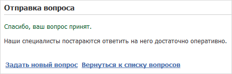

# Сообщение об успешном создании

**Навигация**
- [← Оглавление курса](index.md)
- [← Предыдущий: 5314 — Добавление вопроса](lesson_5314.md)
- [Следующий: 5316 — Ответ на вопрос →](lesson_5316.md)

Официальная страница урока: https://dev.1c-bitrix.ru/learning/course/index.php?COURSE_ID=48&LESSON_ID=5315

|  | #### Уведомим посетителя о том, что вопрос принят |
| --- | --- |


Страница "Ваш вопрос принят" (**mess_send.php**) уведомляет посетителя о том, что вопрос создан. Откройте её на редактирование как HTML из административного раздела (или в режиме редактирования исходного кода в визуальном редакторе) и добавьте:


```
<p><font color="#005824">Спасибо, ваш вопрос принят.</font></p>
<p>Наши специалисты постараются ответить на него максимально оперативно.</p>
<br />
<table>
  <tbody>
    <tr><td> <a href="/question_answer/ask_question.php" ><b>Задать новый вопрос</b></a> </td><td></td><td>
             <a href="/question_answer/index.php" ><b>Вернуться к списку вопросов</b></a> </td></tr>
   </tbody>
 </table>
<br><br>
```


После сохранения изменений страница будет иметь следующий вид:





Ссылки **Задать новый вопрос** и **Вернуться к списку вопросов** ведут на страницы **ask_question.php** и **index.php** соответственно.
