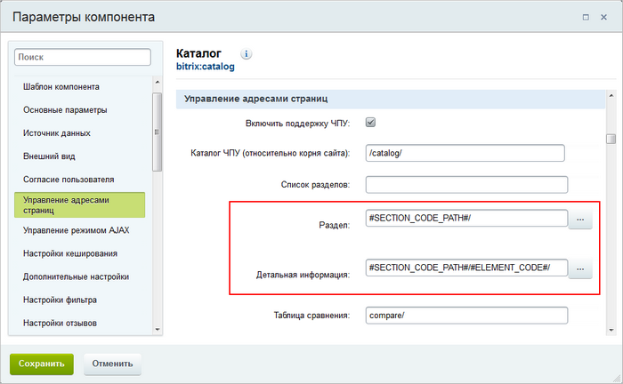

# Вложенные ЧПУ: формируем полные адреса

**Навигация**
- [← Оглавление курса](index.md)
- [← Предыдущий: 2039 — Общий порядок работы с информационными блоками](lesson_2039.md)
- [Следующий: 5840 — Настройка SEO данных в инфоблоке →](lesson_5840.md)

Официальная страница урока: https://dev.1c-bitrix.ru/learning/course/index.php?COURSE_ID=48&LESSON_ID=5319

### Вложенные ЧПУ: формируем полные адреса

Представьте, что инфоблок имеет многоуровневую структуру и некий элемент хранится в подразделе **sectionC**:

Несмотря на вложенность разделов, адрес в браузере при просмотре такого элемента будет иметь вид:

mysite.ru/catalog/sectionC/element/

Вам не подходит такой вариант? Формируйте абсолютные пути к элементам инфоблока вместе с инструментом вложенных ЧПУ:

mysite.ru/catalog/sectionA/sectionB/sectionC/element/

**Примечание:** поддержка вложенных ЧПУ доступна с версии 12.5 модуля **Информационные блоки** и реализована только для комплексных компонентов **catalog**, **news** и **photo**.

### Как выполнить настройки?

1. Откройте форму редактирования инфоблока, для элементов которого вы хотите настроить пути.
2. В полях **URL страницы раздела** и **URL страницы детального просмотра** для настройки шаблонов путей используйте переменную **SECTION_CODE_PATH**:
  
3. Для всех разделов инфоблока укажите
  			символьные коды
                      
  		.
  **Примечание:** настройте обязательность заполнения поля **Символьный код** и вы не будете забывать указывать код при создании новых разделов. Дополнительно можете включить
  			автогенерацию кода
                      
  		 из названия раздела путем транслитерации.
4. Откройте настройки компонента,
  В режиме правки наведите мышь на область компонента, появится панель настроек. Выберите пункт
  **Редактировать параметры компонента**. Откроется форма настройки.
  
  [Подробнее](https://dev.1c-bitrix.ru/learning/course/index.php?COURSE_ID=34&LESSON_ID=9165)...
  		 с помощью которого опубликована информация из инфоблока.
5. Задайте шаблоны адресов с помощью символьных кодов раздела:
  
  **Внимание!** Использование слеша в конце адреса обязательно. Для системы адреса вида `/catalog/section1/element1` и `/catalog/section1/element1/` - это разные адреса.

Теперь просмотр ваших элементов будет выполняться по полным адресам.

### Заключение

Абсолютные пути формируются с помощью переменной **SECTION_CODE_PATH**:

1. укажите ее в форме редактирования инфоблока при настройке шаблонов путей;
2. используйте эту переменную при настройке адресов страниц в компоненте.

Почитайте [следующий урок](/learning/course/index.php?COURSE_ID=34&LESSON_ID=7199) и познакомьтесь, как выделить основную страницу элемента среди всех дублей.
