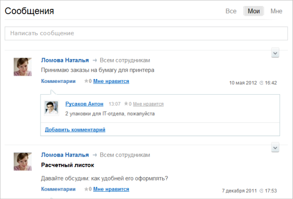

# Возможности модуля Блоги

**Навигация**
- [← Оглавление курса](index.md)
- [← Предыдущий: 3122 — Настройка инфоблоков на работу с бизнес-процессами](lesson_3122.md)
- [Следующий: 2860 — Настройки модуля →](lesson_2860.md)

Официальная страница урока: https://dev.1c-bitrix.ru/learning/course/index.php?COURSE_ID=48&LESSON_ID=5373

Модуль **Блоги** в рамках социальной сети является функционалом **Сообщения**, который дает возможность вести общение как на персональных страницах сотрудников, так и в группах.

Сотрудник может не только добавлять новые сообщения, но и получать комментарии посетителей относительно этих сообщений. Данный функционал позволяет автору предлагать посетителям различные темы для обсуждения, организовывать обмен мнениями по поводу мыслей, высказанных в сообщениях и т.п.

Возможности модуля:

- создавать неограниченное число сообщений;
- управлять правами сотрудников на доступ к сообщениям;
- настраивать иконки и смайлики для использования в сообщениях;
- обрабатывать смайлики и теги при показе сообщений и комментариев;
- использовать**Trackback** механизм;
- группировать сообщения по произвольным темам (tags);
- присоединять изображения, видео и файлы к сообщениям.

**Примечание**. Trackback — это механизм уведомления сайта A (на нем может находиться, например, некая «родительская» статья) о существовании некоторого другого сайта B (например, с «дочерней» статьей или некоторым комментарием).
