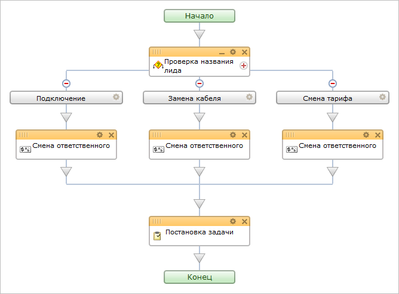
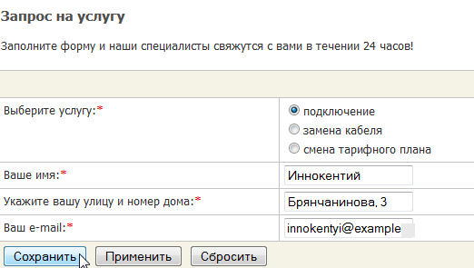
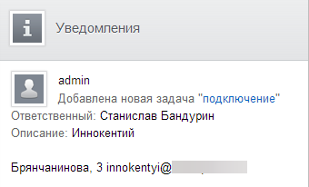
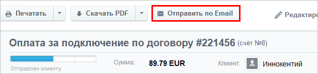
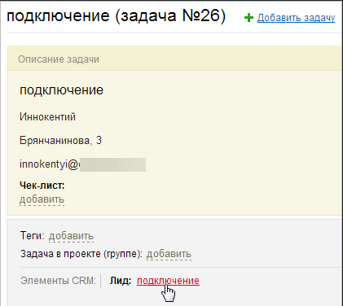
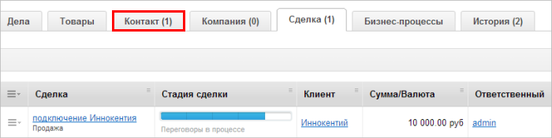
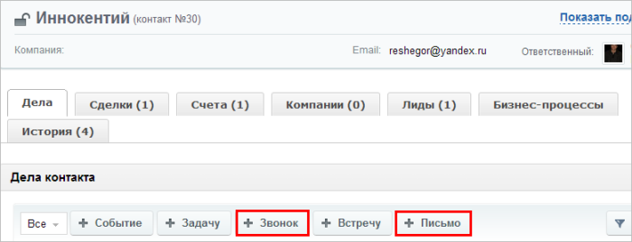
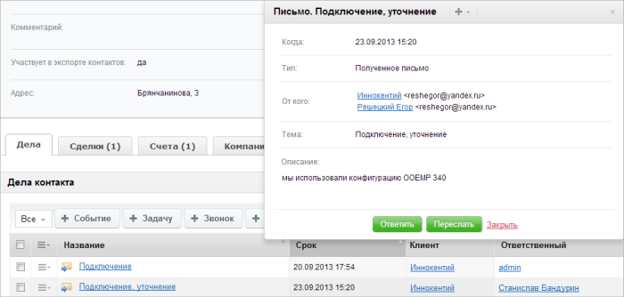

# Сценарий для работы службы техподдержки

**Навигация**
- [← Оглавление курса](index.md)
- [← Предыдущий: 5823 — Автоматизация исполнения проекта](lesson_5823.md)
- [Следующий: 5277 — Модератор форума →](lesson_5277.md)

Официальная страница урока: https://dev.1c-bitrix.ru/learning/course/index.php?COURSE_ID=48&LESSON_ID=5515

### Постановка задачи

Рассмотрим, как можно организовать работу технической службы, в которую поступают заявки от клиентов на проведение работ и исправление неисправностей.

Клиенты заполняют форму на сайте, в которой указывают свои данные и выбирают причину обращения. Данная информация, путем настроенной интеграции, передается в CRM в виде лида, к которому автоматически привязывается задача под ответственность соответствующего задаче специалиста.

Далее лид администратором конвертируется в контакт и сделку, клиенту выставляется счет. По всем необходимым вопросам с ним ведется общение по телефону или email, что автоматизированно фиксируется в CRM. После того, как работа завершена, задача и сделка закрываются.

**Внимание!** Описание работ дано для шаблона Lite. В шаблоне Битрикс24 работа идентична, но внешний вид форм будет иным.

### Бизнес-процесс

Для автоматизированной обработки поступающего в CRM лида, предварительно [создайте бизнес-процесс](/learning/course/index.php?COURSE_ID=48&CHAPTER_ID=05058):

Согласно данному бизнес-процессу, в зависимости от названия создаваемого в системе лида (**подключение**, **замена кабеля**, **смена тарифного плана**), создается задача на соответствующего каждой услуге ответственного, в которую переносятся данные лида (имя, адрес, email) и прикрепляется сам лид.

**Примечание:**вы можете [скачать данный шаблон](/images/portal_admin/examples/bp-15.bpt), а затем [импортировать](/learning/course/index.php?COURSE_ID=48&LESSON_ID=3858), однако вам необходимо будет настроить его под себя.

### Как всё работает

1. Клиент заполняет [веб-форму](lesson_5153.md) на вашем сайте:
  
  При [настроенной интеграции](lesson_3642.md), данные из веб-формы автоматически будут отправлены в CRM в качестве лида.
2. Специалисту придет уведомление о поступившей на его имя задаче:
  
3. Когда ответственный освобождается, он запускает ее выполнение, о чем администратору, указанному в бизнес-процессе как постановщик, придет уведомление.
4. После того, как задача начала выполняться, администратор конвертирует лид данной заявки в контакт (новый, либо уже существующий), за который назначает ответственным соответствующего специалиста, и в сделку (где ответственным остается он сам). Назначение специалиста ответственным необходимо для того, чтобы при дальнейшем общении с контактом по email, уведомления об ответных письмах приходили в его центр нотификаций, а не администратора. Затем администратор выставляет счет и отправляет его по e-mail:
  
5. После поступления оплаты, ответственный за задачу специалист начинает работу. Из задачи он может перейти к лиду данной заявки:
  
  Из лида можно перейти к
  			сделке или контакту
                      
  		.
6. Сотрудник может вести общение с клиентом по email или с помощью телефона, добавляя звонки к сущности:
  
  Ответные письма будут
  			привязываться к контакту
                      
  		, в который был сконвертирован лид.
7. Как только работа по оказанию требуемой услуги клиенту будет выполнена, специалист закрывает задачу, о чем постановщик (администратор) будет проинформирован уведомлением. Сделка закрывается.
  Историю изменений сущности, а также выполненных дел и задач, вы можете просмотреть на закладке **История**.
