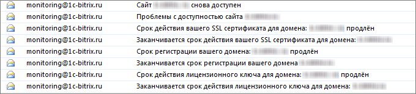
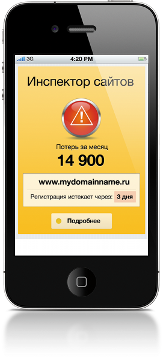
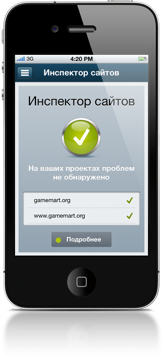
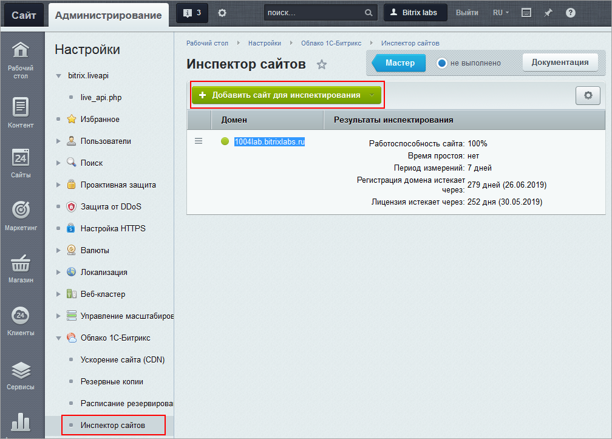
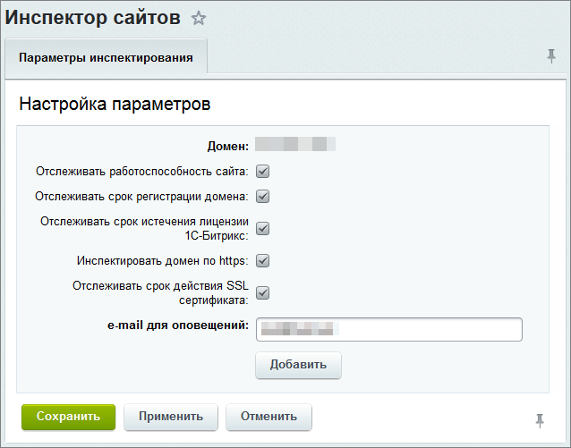

# Инспектор сайтов

**Навигация**
- [← Оглавление курса](index.md)
- [← Предыдущий: 2743 — Возможности штатных средств модуля](lesson_2743.md)
- [Следующий: 11669 — Облако 1С-Битрикс - настройки модуля →](lesson_11669.md)

Официальная страница урока: https://dev.1c-bitrix.ru/learning/course/index.php?COURSE_ID=48&LESSON_ID=5517

### Инспектор сайтов. Видеоурок

Инспектор сайтов периодически проверяет доступность сайта и [сообщает](#notifications) обо всех неполадках через E-mail или push-уведомления для мобильных устройств.

**Примечание:** Проверка осуществляется со стороны серверов компании *"1С-Битрикс"*, поэтому сайт должен быть доступен "снаружи".

Инспектор сайтов отслеживает 4 параметра, очень важных для работы любого веб-проекта, и особенно интернет-магазина:

- раз в 5 минут проверяет доступность сайта из двух географических точек;
- раз в день проверяет срок действия домена.
  	Инспектор сайта напомнит за 30 дней о необходимости продлить домен. Повторяться напоминания будут раз в неделю, пока домен не будет продлен.
- раз в день проверяет срок SSL-сертификата;
- раз в день проверяет срок действия лицензионного ключа.
  	Инспектор сайта напомнит за 30 дней об окончании срока активности обновлений и технической поддержки для вашей лицензии.

### Способы получения информации

Предусмотрены следующие способы получения информации от Инспектора сайта:

- Гаджет на рабочем столе вашего сайта
  
  Гаджет покажет
  			процент простоев
                      Например, если в течение 7 суток (10080 минут) ваш сайт был недоступен 15 минут, то процент простоев составит (10080-15)/10080*100% = 0,15%.
  [Подробнее...](https://ru.wikipedia.org/wiki/%D0%92%D1%8B%D1%81%D0%BE%D0%BA%D0%B0%D1%8F_%D0%B4%D0%BE%D1%81%D1%82%D1%83%D0%BF%D0%BD%D0%BE%D1%81%D1%82%D1%8C)
  		 вашего сайта или, если это магазин, потери в деньгах (высчитывается по средней сумме заказов за аналогичный промежуток времени при работоспособности сайта).
  **Примечание:** Из-за кеширования и проверок, что сайт точно восстановил свою работоспособность, статус сайта в **"Гаджете на рабочем столе сайта"** и **"Мобильном приложении"** обновляется не сразу, а лишь через некоторое время.
- Страница **Инспектор сайтов** (Настройки &gt; Облако 1С-Битрикс &gt; Инспектор сайтов), на которой отображается детальная информация по всем параметрам инспектирования:
  
- Письма на адрес электронной почты, указанный при [добавлении сайта](#monitor_add) в инспектор:
  
  После обнаружения проблемы инспектором, на указанный почтовый адрес придет соответствующее уведомление в течение 3-9 минут.
  **Примечание:** После установки обновления сайт(ы) автоматически добавляется в список инспектируемых сайтов. E-mail для оповещения берется из настроек Главного модуля, а если там адрес не указан, то из настроек сайта.
- [Мобильное приложение для администрирования сайтов](http://dev.1c-bitrix.ru/community/blogs/product_features/1cbitrix-administration-is-a-mobile-application-for-order-management.php), в котором можно просматривать статистику инспектора по сайту и получать push-уведомления (с версии модуля **bitrixcloud 14.0.1**).
    
  		Соответственно, доступны настройки для редактирования записей о сайтах (какие сайты, что проверять) и включение/выключение push-нотификаций.

### Настройка

1. Для корректной работы сервиса для инспектируемого сайта должен быть указан домен на странице **Редактирования сайта** (Настройки продукта &gt; Сайты &gt; Список сайтов &gt; требуемый_сайт) *или* в поле **URL сайта** настроек **Главного модуля** (Настройки &gt; Настройки продукта &gt; Настройки модулей &gt; Главный модуль).
2. После чего необходимо перейти на страницу **Инспектор сайтов** (Настройки &gt; Облако 1С-Битрикс &gt; Инспектор сайтов) и с помощью соответствующей кнопки
  			Добавить сайт для инспектирования
                      
  		.
  

**Примечание:** На странице настроек модуля

			Облако 1С-Битрикс

Для настройки модуля **Облако 1С-Битрикс** перейдите на страницу Настройки &gt; Настройка Продукта &gt; Настройки модулей &gt; Облако 1С-Битрикс

[Подробнее](lesson_11669.md)...

		 можно указывать период времени, который будет использован для расчета и отображения информации на странице **Инспектор сайтов** (Настройки &gt; Облако 1С-Битрикс &gt; Инспектор сайтов).

### Документация по теме

- [Инспектор сайтов 1С-Битрикс](http://dev.1c-bitrix.ru/community/blogs/product_features/cloud_inspector.php) (Блог)
- [«1С-Битрикс Администрирование» - мобильное приложение для управления заказами](http://dev.1c-bitrix.ru/community/blogs/product_features/1cbitrix-administration-is-a-mobile-application-for-order-management.php) (Блог)
- [Облако 1С-Битрикс (пользовательская документация)](https://dev.1c-bitrix.ru/user_help/settings/bitrixcloud/index.php)
