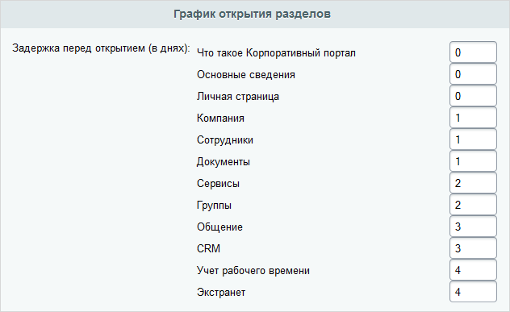

# Учебные группы

**Навигация**
- [← Оглавление курса](index.md)
- [← Предыдущий: 3105 — Результаты обучения](lesson_3105.md)
- [Следующий: 2873 — Курсы →](lesson_2873.md)

Официальная страница урока: https://dev.1c-bitrix.ru/learning/course/index.php?COURSE_ID=48&LESSON_ID=5792

Начиная с версии **14.0.0** модуля **Обучение** доступен функционал учебных групп, позволяющий контролировать процесс обучения. Теперь в системе не нужно создавать группы пользователей, которые имели бы доступ к тем курсам, по которым проводится отдельное обучение. Для таких курсов создается учебная группа, в которой указываются время ее работы, доступность материалов в процессе изучения курса и список обучающихся пользователей.

**Важно!** Если участник учебной группы входит в некоторую группу пользователей, которая обладает правом на курс не ниже **Просмотр**, то ему всегда будет доступен весь этот курс независимо от настроек учебной группы.

|  | ### Создание учебной группы |
| --- | --- |

Допустим, что курс, по которому будет проводиться отдельное обучение, уже создан и недоступен для обычных пользователей (иначе весь смысл учебной группы теряется). Теперь можно приступить к созданию и настройке учебной группы.

Перейдите на страницу **Список учебных групп** (Сервисы &gt; Обучение &gt; Учебные группы) и нажмите кнопку **Добавить**. Откроется форма:

- Обязательно в соответствующих полях укажите **название** учебной группы и выберите **учебный курс**, по которому будет проходить обучение.
- В поле **Период активности** задайте временной интервал, в течение которого будет доступен курс для изучения, а также отметьте опцию **Запись активна**, чтобы обучение могло осуществляться.
- В поле **Состав учебной группы** укажите пользователей, которые будут проходить обучение в рамках данной группы.

На закладке **Доп. поля** можно заполнить имеющиеся пользовательские поля для рабочих групп или перейти к добавлению новых.

**Примечание:** подробное описание каждого поля представлено в [документации по продукту.](http://dev.1c-bitrix.ru/user_help/service/learning/learn_group_edit.php)

Нажмите кнопку **Применить**, чтобы получить доступ к настройкам графика открытия разделов курса и продолжить редактирование учебной группы. Если вам не требуется настройка графика или вы хотите сделать это позднее, то нажмите **Сохранить**.

Настройка графика открытия разделов курса выполняется для всех глав/уроков верхнего уровня:

Для каждой главы (урока) указывается, через сколько дней после начала обучения она станет доступной. После того, как график составлен, не забудьте сохранить настройки учебной группы.

В результате до наступления начала обучения курс будет недоступен для пользователей, а затем

			откроется в соответствии с настройками графика.

