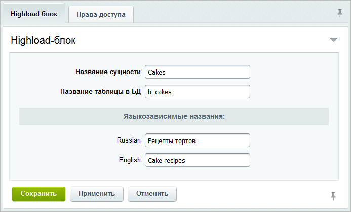
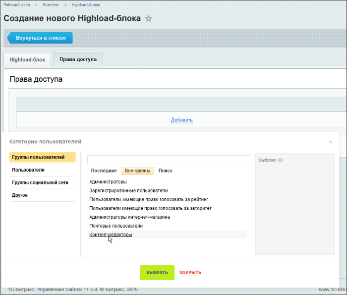
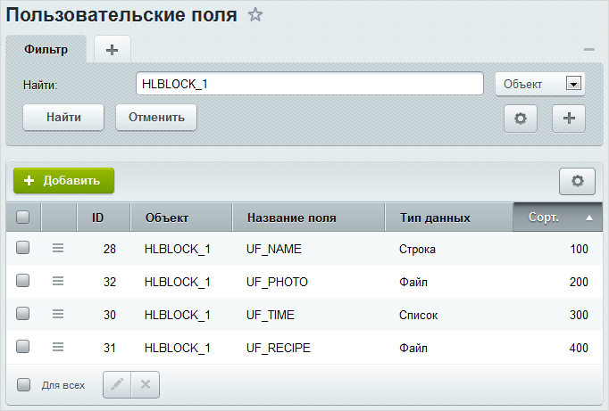

# Настройка Highload-блока

**Навигация**
- [← Оглавление курса](index.md)
- [← Предыдущий: 5797 — Highload-блоки](lesson_5797.md)
- [Следующий: 5194 — Пример работы со свойством типа "Справочник" →](lesson_5194.md)

Официальная страница урока: https://dev.1c-bitrix.ru/learning/course/index.php?COURSE_ID=48&LESSON_ID=5799

### Настройка

Настройка Highload-блоков выполняется в административном интерфейсе и заключается в следующем:

- создается Highload-блок и определяется таблица, в которой будут храниться его данные;
- настраиваются поля Highload-блока, которые являются пользовательскими свойствами ядра;
- добавляется необходимое число записей в Highload-блок.

Рассмотрим процесс работы с Highload-блоками на примере создания справочника рецептов тортов.

### Создание

Перейдите на страницу Контент &gt; Highload-блоки и нажмите кнопку **Добавить Highload-блок**. Откроется форма:

Заполните поля на закладке **Highload-блок**:

- В поле **Название сущности** задайте название Highload-блока. Название должно начинаться с заглавной буквы и состоять только из латинских букв и цифр.
- В поле **Название таблицы в БД** укажите название таблицы, в которой будет храниться новый Highload-блок. Название таблицы должно состоять только из строчных латинских букв, цифр и знака подчеркивания.
- Укажите удобные для вас языкозависимые названия Highload-блока.

На закладке **Права доступа** настройте доступ для пользователей и групп пользователей к Highload-блоку. Выбор необходимых групп или пользователей осуществляется по ссылке **Добавить**:

**Примечание:** закладка **Права доступа** доступна с версии 17.0.0 модуля **Highload-блоки**.

Сохраните новый Highload-блок.

### Создание полей сущности

Для добавления полей в Highload-блок перейдите на страницу со списком его полей одним из способов:

- со страницы со списком Highload-блоков выбрать в меню действий необходимого блока пункт
  			Список полей
                      
  		;
- в форме редактирования нажать на
  			ссылку с количеством полей
                      
  		 сущности.

В любом случае откроется страница

			Пользовательские поля

                    На странице **Пользовательские поля** (*Настройки &gt; Настройки продукта &gt; Пользовательские поля*) можно добавлять новые поля, просматривать и изменять существующие, удалять ненужные пользовательские поля.

						[Описание компонента «Пользовательские поля» в пользовательской документации.](http://dev.1c-bitrix.ru/user_help/detail.php?ID=63455)

		 с установленным фильтром по объекту **HLBLOCK_*&lt;ID_блока&gt;***, где *&lt;ID_блока&gt;* - это идентификатор Highload-блока, для которого необходимо добавить поля. Тип поля выбирается из

			выпадающего списка

                    

		.

С помощью расположенной на контекстной панели кнопки **Добавить** создайте необходимые поля для Highload-блока.

**Примечание:** процесс добавления пользовательского поля описан в уроке [Пример добавления поля](lesson_8611.md).

Для нашего примера добавим следующие поля: **Название торта (UF_NAME)** типа *Строка*, **Фото (UF_PHOTO)** типа *Файл*, **Время приготовления (UF_TIME)** типа *Список* и **Рецепт (UF_RECIPE)** типа *Файл*:

### Создание записей сущности

Чтобы добавить запись в Highload-блок, перейдите на страницу со списком его записей (Контент &gt; Highload-блоки &gt; *[языковое_название_Highload-блока]*, в нашем примере это **Рецепты тортов**) и нажмите кнопку **Добавить запись**. Откроется форма с набором созданных полей Highload-блока:

Заполните поля и сохраните запись. Аналогичным образом добавьте необходимое количество записей.

**Примечание:** перейти к списку записей Highload-блока также можно из формы его редактирования (с помощью ссылки с количеством записей) или со страницы со списком Highload-блоков (используя пункт **Список записей** в меню действий).

### Документация по теме

- [Создание и редактирование Highload-блока](https://dev.1c-bitrix.ru/user_help/content/highloadblock/highloadblock_entity_edit.php)
