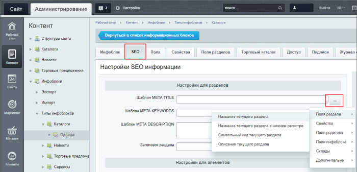
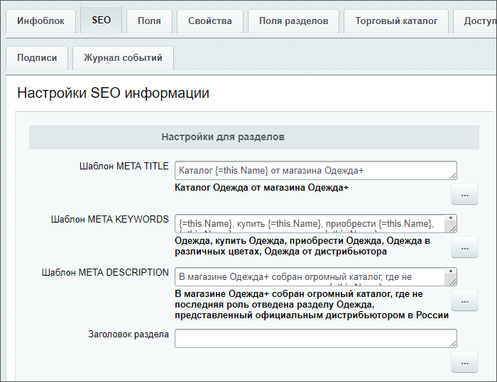
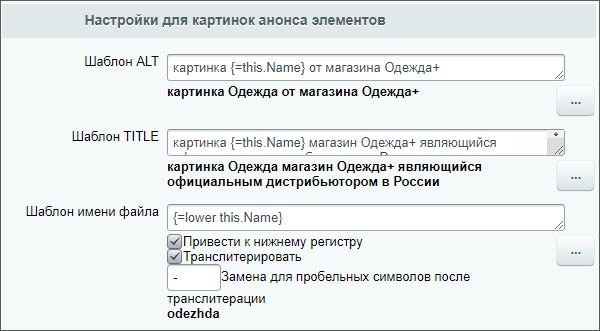
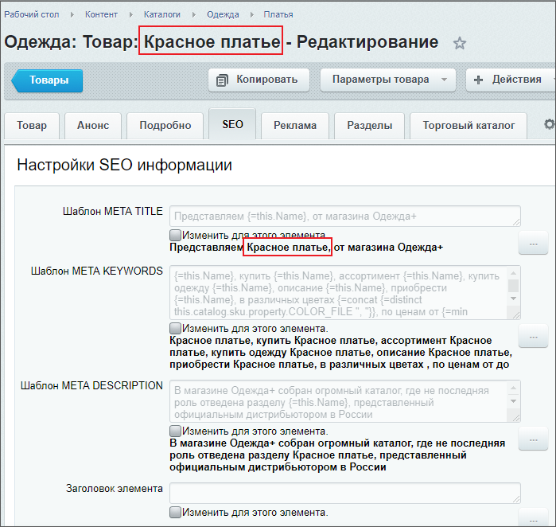
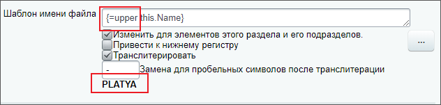

# Настройка SEO данных в инфоблоке

**Навигация**
- [← Оглавление курса](index.md)
- [← Предыдущий: 5319 — Вложенные ЧПУ: формируем полные адреса](lesson_5319.md)
- [Следующий: 7243 — Редактор изображений в элементах инфоблока →](lesson_7243.md)

Официальная страница урока: https://dev.1c-bitrix.ru/learning/course/index.php?COURSE_ID=48&LESSON_ID=5840

Используйте параметры вкладки SEO для настройки ключевых слов и описаний инфоблока (его разделов и элементов). Это влияет на

			продвижение сайта

                    В курсе [Продвижение сайта и маркетинг](https://dev.1c-bitrix.ru/learning/course/index.php?COURSE_ID=139&LESSON_ID=2183) описаны рекомендации по оптимизации сайтов для продвижения в поисковой выдаче.

		 в поисковой выдаче.


### Видеоурок

Настраивайте шаблоны метаданных для всего инфоблока или создавайте персональную настройку для конкретных разделов и элементов раздела. В видео показан пример настройки для инфоблока новостей.

### Настраиваем SEO

Давайте еще посмотрим, как это сделать на примере

			инфоблока

                    Мы рассмотрим пример настройки инфоблока каталога товаров. SEO торговых предложений настраивается по аналогичному алгоритму. Настройте сам инфоблок, а затем, по необходимости, SEO конкретных торговых предложений индивидуально.

		 **Одежда**.

Шаблоны

			метаданных

                    Данные подставляются в именительном падеже. Склонение по падежам не предусмотрено. Воспользуйтесь **Маркетплейсом** для поиска дополнительных решений.
[Подробнее](https://dev.1c-bitrix.ru/user_help/marketplace/update_system_market.php)...

		 для инфоблока (всех его разделов и элементов) настраиваются в форме редактирования инфоблока (Контент &gt; Инфоблоки &gt; Типы инфоблоков &gt; _ваш_инфоблок_) на

			вкладке **SEO**

                    Также смотрите описание полей вкладки **SEO** в пользовательской документации.
[Подробнее](https://dev.1c-bitrix.ru/user_help/content/iblock/iblock_edit.php#SEO)...

		. В первых двух секциях настройки шаблонов мета-тегов *TITLE*, *KEYWORDS*, *DESCRIPTION* и

			заголовков

                    HTML-тег **H1**

		 страницы раздела/элемента. Для выбора шаблона служит кнопка **[...]** рядом с каждым полем:



Заполним настройки для **разделов** и для **элементов**:



В последующих секциях вкладки **SEO**

			выполняются настройки

                    Например, для нашего инфоблока выполним настройки для **картинок анонса** и
для **детальных картинок элементов** так:


		 шаблонов для тегов *ALT*, *TITLE* и  имени файлов картинок анонса и детальных картинок разделов/элементов инфоблока.

**Внимание**! Настройки шаблона имени файлов работают только для тех файлов, которые загружены в систему после выполнения настроек. Для ранее загруженных файлов настройки не применяются.

Все ваши настройки SEO в инфоблоке видны в формах редактирования его разделов и элементов. Посмотрим, как это выглядит на примере раздела **Платья** инфоблока **Одежда** и увидим, что во всех шаблонах правильно подставилось название текущего раздела:


Если необходимо изменить какую-то из настроек, отметьте опцию **Изменить для этого раздела и его подразделов** или кликните мышью по полю (опция отметится автоматически). Теперь доступна кнопка **[...]** для выбора шаблона и ручной ввод. Обязательно отметьте при этом опцию

			Очистить кеш вычисленных значений

                    

		. В этом случае кеш шаблонов очищается и все изменения сразу отобразятся.

**Примечание:** Для отображения заголовка из параметра **Заголовок раздела** на странице раздела, отметьте опцию **Устанавливать заголовок страницы** в компоненте, который выводит данные инфоблока.

Теперь добавим новый

			элемент

                    Настройки SEO для конкретного элемента инфоблока выполняются аналогично настройкам конкретного раздела.

		 в наш инфоблок **Одежда**, раздел **Платья**. После заполнения необходимых полей формы нажимаем кнопку **Применить** (или **Сохранить**). Данные нового элемента

			подставятся

                    

		 в шаблоны настроек SEO.

## Как выглядит исходный код страницы после настроек SEO

Если просмотреть исходный код страницы раздела **Платья**, то мы увидим в нем все заданные в настройках метатеги:

```

<head>
...
<meta name="keywords" content="Платья, купить Платья, приобрести Платья, Платья в различных цветах, Платья от дистрибьютора">
<meta name="description" content="В магазине Одежда+ собраны уникальные Платья, представленный официальным дистрибьютором в России">
...
<title>Уникальные Платья от магазина Одежда+</title>
...
</head>
```

### Фильтры-обработчики

Создавая шаблоны, при необходимости, используйте фильтры-обработчики вручную:

- `{=lower arg1 ... argN}` - приведение к нижнему регистру;
- `{=upper arg1 ... argN}` - приведение к верхнему регистру;
- `{=ucfirst arg1 ... argN}` - приведение
  			первого символа
                      Если в фигурных скобках перечислено несколько аргументов, то в верхний регистр будет приведен символ только первого аргумента.
  		 в верхний регистр, если этот символ является буквой. Доступен с версии 21.600.0 модуля Информационные блоки;
- `{=ucwords arg1 ... argN}` - приведение в верхний регистр первого символа каждого слова. Доступен с версии 21.600.0 модуля Информационные блоки;
- `{=concat arg1 ... argN ", "}` - сцепление строк через разделитель;
- `{=limit arg1 ... argN "<delimiter>" NN}` - ограничение NN элементов по разделителю;
- `{=translit arg1 ... argN}` -
  			транслитерация
                      Т.е. написание текста символами латиницы. Например слово **платья** будет заменено на **platya**.
  		 выбранных аргументов;
- `{=min arg1 ... argN}` - выборка минимального числового значения;
- `{=max arg1 ... argN}` - выборка максимального числового значения;
- `{=distinct arg1 ... argN}` - уникальные (без дублей) значения.

Пример: у нас указано `{=lower this.Name}`. А мы хотим привести к верхнему регистру. Заменим вручную *lower* на *upper*. Результат применения сразу отобразится под полем ввода:



### Документация по теме

- [Создание и редактирование информационного блока. Вкладка SEO](https://dev.1c-bitrix.ru/user_help/content/iblock/iblock_edit.php#SEO);
- [Создание и редактирование раздела инфоблока. Вкладка SEO](https://dev.1c-bitrix.ru/user_help/content/iblock/iblock_section_edit.php#seo);
- [Создание и редактирование элемента инфоблока. Вкладка SEO](https://dev.1c-bitrix.ru/user_help/content/iblock/iblock_element_edit.php#seo);
- [Настройка SEO информации](https://dev.1c-bitrix.ru/learning/course/index.php?COURSE_ID=34&LESSON_ID=6305) в главе **Разделы и элементы** курса Контент-менеджер.
