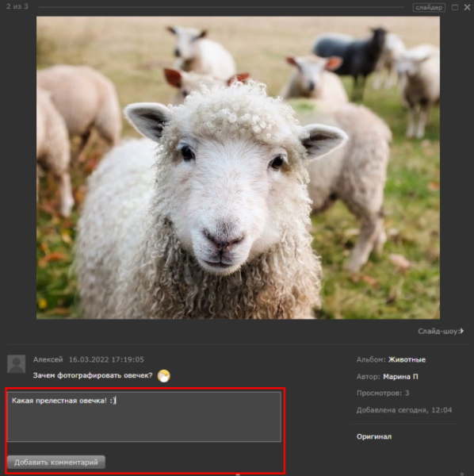
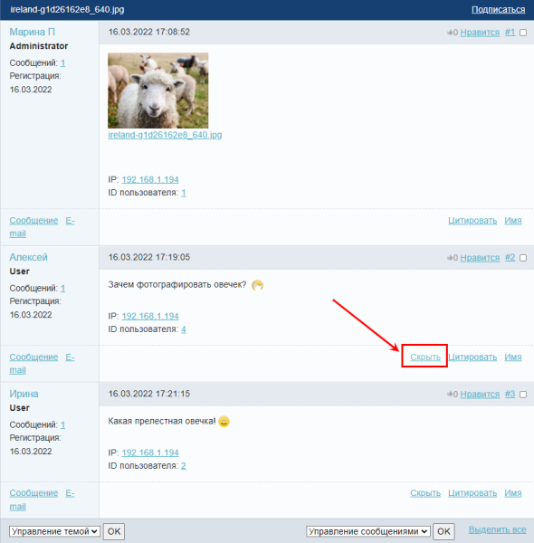

# Работа с комментариями многопользовательской галереи

**Навигация**
- [← Оглавление курса](index.md)
- [← Предыдущий: 8611 — Пример добавления поля](lesson_8611.md)
- [Следующий: 2377 — Постановка задачи →](lesson_2377.md)

Официальная страница урока: https://dev.1c-bitrix.ru/learning/course/index.php?COURSE_ID=48&LESSON_ID=6471

Модерировать комментарии к фотографиям, если фотогалерея развитая, трудозатратно. Приходится открывать все фотографии и смотреть, есть ли комментарии. Гораздо удобнее модерировать всё в одном месте. Сделать это не сложно.

### Видеоурок

### Операции с форумом

Отзывы в Фотогалерее реализуются через функционал модуля

			Форум

                    Модуль Форум "1С-Битрикс: Управление сайтом" предназначен для управления форумами сайта. С помощью этого модуля решаются следующие задачи:

[Подробнее](https://dev.1c-bitrix.ru/learning/course/index.php?COURSE_ID=34&LESSON_ID=5139)...

		. Как узнать, какой именно форум для нее используется? Перейдите к настройкам компонента

			Многопользовательская фотогалерея

                    Комплексный компонент **Фотогалерея 2.0 (многопользовательская)** позволяет получить полнофункциональную многопользовательскую фотогалерею, создавая физически только одну страницу.

						[Описание компонента «Фотогалерея 2.0 (многопользовательская) (комплексный компонент)» в пользовательской документации.](http://dev.1c-bitrix.ru/user_help/detail.php?ID=139125)

		, и в группе параметров **Настройки отзывов** вы увидите ID форума для отзывов:

**Примечание:** Форум, предназначенный для отзывов, должен быть заранее создан. Созданием и настройкой форумов занимается Администратор. Подробнее описано в курсе [Администратор. Модули](https://dev.1c-bitrix.ru/learning/course/index.php?COURSE_ID=41&CHAPTER_ID=04552).

Перейдите на страницу административного раздела Сервисы &gt; Форумы &gt; Список форумов &gt; ваш_форум. В форме редактирования форума на вкладке **Доступ** установите права доступа к форуму (или попросите об этом Администратора сайта если у вас нет прав для работы с форумами):

- Для группы модераторов право доступа **Модерирование**;
- Для пользователей, которые имеют право оставить комментарии, право доступа **Новая тема** (например, это могут быть все *Зарегистрированные пользователи*)

### Создание страницы для модерации

Создайте страницу

[Как создать страницу через публичную часть сайта](https://dev.1c-bitrix.ru/learning/course/index.php?COURSE_ID=34&LESSON_ID=1911) (учебный курс «Контент-менеджер»)

[Как создать страницу через административную часть сайта](lesson_2021.md) (учебный курс «Администратор. Базовый»)

		 и закройте страницу от всех,

			кроме группы модераторов комментариев

                    

		 к галерее. Затем разместите на странице комплексный компонент **Форум**. В настройках компонента, среди прочего, укажите форум многопользовательской галереи в опции **Показывать только выбранные форумы**:

В результате модераторы будут видеть форум многопользовательской галереи, в темы которого будут добавляться комментарии. Непосредственно в теме можно

			модерировать комментарии.

Для управления сообщениями отметьте нужные из них галочками и выберите нужную команду из меню :

**Скрыть сообщения** - сообщения станут недоступными для просмотра всем, кроме тех, кто имеет право на модерирование форума. Для модераторов скрытые сообщения будут видны и выделены другим цветом. Скрытые сообщения можно опять показать в теме при необходимости.

**Перенести сообщения** - перемещает выбранные сообщения в другую тему с помощью формы:

[Подробнее](lesson_5277.md)...

### Пример работы с комментариями

Теперь, после всех настроек, под открытой фотографией из галереи появится кнопка **Добавить комментарий**. По нажатии на неё пользователю раскроется форма создания сообщения:

Модератору, на специально созданной странице, доступен форум для модерирования комментариев, где он может, например, скрыть комментарий:

Как только пользователь оставит первый комментарий под фотографией, на форуме автоматически будет создана тема с первым сообщением от имени Автора фото и прикрепленной фотографией. Все последующие сообщения - комментарии пользователей.

**Примечание:** работа с комментариями галереи различается в зависимости от шаблона компонента. Штатно в компоненте доступно

			два шаблона

                    

		: **old** и **.default**. Отличаются они внешним видом и просмотром фотографий, а также только в шаблоне **old** для комментариев доступен редактор текста.

**Важно:** В настоящий момент при использовании шаблона **.default** могут возникать ошибки при добавлении комментария к фото (*Элемент ... не найден* или скрытие существующих комментариев). При возникновении ошибок помогает обновление текущей страницы с открытой фотографией в браузере. Если ошибки возникают постоянно - обратитесь в [техническую поддержку](https://www.1c-bitrix.ru/support/customers/ticket.php?show_wizard=Y).
