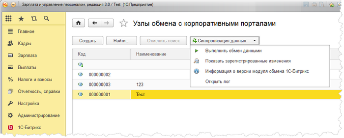

# Узлы обмена

**Навигация**
- [← Оглавление курса](index.md)
- [← Предыдущий: 6692 — Общая панель модуля обмена](lesson_6692.md)
- [Следующий: 6812 — Настройка экспорта кадровой информации →](lesson_6812.md)

Официальная страница урока: https://dev.1c-bitrix.ru/learning/course/index.php?COURSE_ID=48&LESSON_ID=6655

Экспорт кадровой информации осуществляется с помощью узлов обмена с корпоративным порталом. Список узлов доступен по следующему адресу: 1С-Битрикс &gt; Экспорт кадровой информации &gt; Обмен с корпоративным порталом.

В списке всегда есть предопределенный узел обмена, который нельзя использовать. Он с незаполненным наименованием.

При нажатии на кнопку **Синхронизация данных** отобразится всплывающее меню со следующими пунктами меню:

- **Выполнить обмен данными** - будет выполнен обмен данными для выбранного в списке узла.
- **Показать зарегистрированные изменения** - для выбранного в списке узла обмена откроется форма, в которой можно просмотреть все зарегистрированные изменения узла.
- **Информация о версии модуля обмена 1С-Битрикс** - отобразится информация о номере версии используемого модуля обмена.
- **Открыть лог** - откроется файл с логами обмена для выбранного узла за указанную дату.
