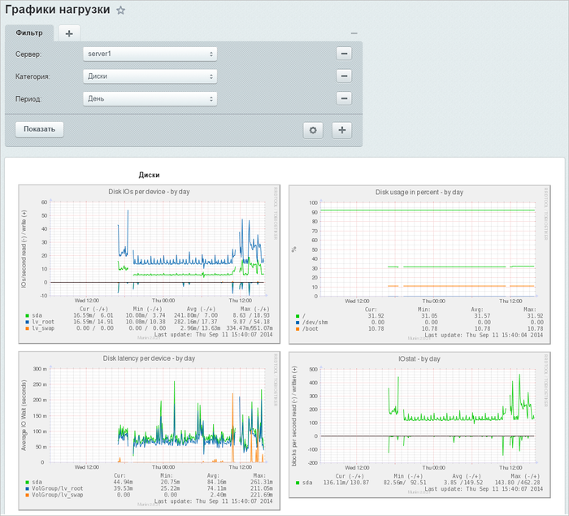

# Графики нагрузки

**Навигация**
- [← Оглавление курса](index.md)
- [← Предыдущий: 6725 — Действия над сервером](lesson_6725.md)
- [Следующий: 6736 — Роли →](lesson_6736.md)

Официальная страница урока: https://dev.1c-bitrix.ru/learning/course/index.php?COURSE_ID=48&LESSON_ID=6664

**Внимание**. Модуль Управление масштабированием (scale) устарел и больше не поддерживается.

|  | ### Наглядное отображение |
| --- | --- |

Детальные графики нагрузок различных сервисов на каждом сервере отображаются на странице **Графики нагрузки** (Настройки &gt; Управление масштабированием &gt; Графики нагрузки). Выберите с помощью фильтра нужный сервер, категорию и период для вывода графиков:

Система мониторинга позволяет выводить графики сервисов **за день**, **неделю**, **месяц** и **год** для каждого сервера пула, используя панель фильтра:

| **Apache**:
 - CPU usage by httpd - Apache accesses - Apache processes - Apache volume | **MySQL**:
 - CPU usage by mysqld - MySQL queries - MySQL slow queries - MySQL threads - MySQL throughtput |
| --- | --- |
| **Nginx**:
 - CPU usage by nginx - Nginx status - Nginx requests | **Сеть**:
 - Connections through firewall - Firewall Throughtput - Netstat - ipconntrack |
| **Система**:
 - CPU usage - File table usage - Inode table usage - Load average - Memory usage - Swap in/out - Uptime | **Диски**:
 - Disk IOs per device - Disk latency per device - Disk usage per persent - IOstat - Inode usage per persent - Throughtput per device |
| **Процессы**:
 - Forkrate - Number of threads - Processes - VMstat |  |

**Внимание**: Для вывода графиков нагрузок предварительно  [включите мониторинг](lesson_6724.md#monitor_on) в меню **Глобальные действия** пула.
