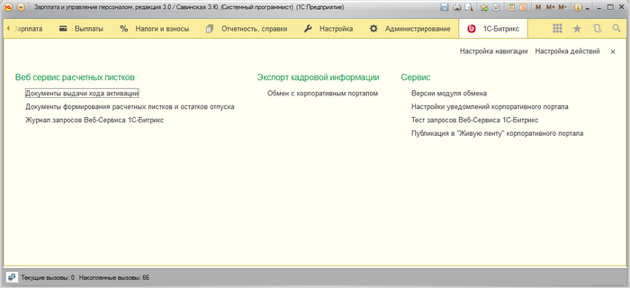

# Общая панель модуля обмена

**Навигация**
- [← Оглавление курса](index.md)
- [← Предыдущий: 6721 — Установка модуля обмена](lesson_6721.md)
- [Следующий: 6655 — Узлы обмена →](lesson_6655.md)

Официальная страница урока: https://dev.1c-bitrix.ru/learning/course/index.php?COURSE_ID=48&LESSON_ID=6692

Если модуль обмена был корректно установлен, то в 1С появляется раздел **1С-Битрикс**, в котором настраивается обмен с порталом и выгрузка данных.

Из группы **Веб сервис расчетных листков** можно перейти на объекты 1С, использующиеся для функционала расчетных листков:

- При нажатии на **Документы выдачи кода активации** открывается форма, в которой можно посмотреть
  			документы по выдаче кодов активации
  
  [Подробнее...](lesson_6815.md)
  		 сотрудников на портале, а также выдать новый код активации сотруднику.
- При нажатии на **Документы формирования расчетных листков и остатков отпуска** открывается форма, в которой можно посмотреть
  			документы
  
  [Подробнее...](lesson_6816.md)
  		, хранящие сформированные расчетные листки и остатки отпуска, которые потом по запросу сотрудника высылаются на портал.
- При нажатии на **Журнал запросов Веб-Сервиса 1С-Битрикс** открывается форма, в которой можно посмотреть
  			историю запросов портала к 1С
  
  [Подробнее...](lesson_6817.md)
  		 по получению расчетных листков и остатков отпуска.

Из группы **Экспорт кадровой информации** можно перейти в

			узел обмена

[Подробнее...](lesson_6655.md)

		, хранящий настройки обмена предназначенные для экспорта кадровой информации на портал. Чтобы зайти в список узлов настроек необходимо нажать на **Обмен с корпоративным порталом**.

Группа **Сервис** содержит элементы по переходу на формы служебных данных и настроек:

- При нажатии на **Версии модуля обмена** открывается форма, в которой можно посмотреть текущую версию модуля обмена с порталом.
- При нажатии на **Настройки уведомлений корпоративного портала**  открывается
  			форма
  
  [Подробнее...](lesson_6822.md)
  		, в которой указываются константы, требующиеся для отправки уведомлений на портал.
- При нажатии на **Тест запросов Веб-Сервиса 1С-Битрикс** запускается обработка, позволяющая тестировать работу функционала расчетных листков.
- При нажатии на **Публикация в "Живую ленту" корпоративного портала** запускается форма, позволяющая
  			отправлять информацию в живую ленту
                       
  [Подробнее...](lesson_6823.md)
  		 портала.
