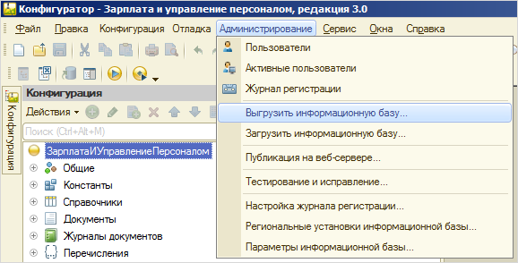
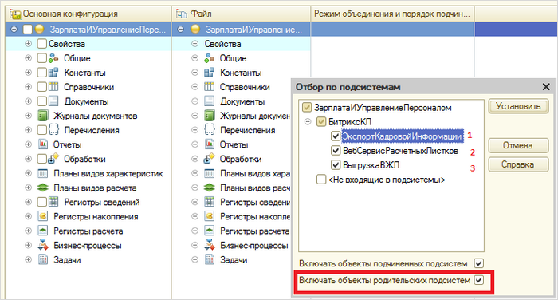
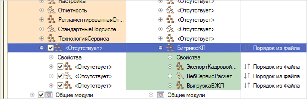
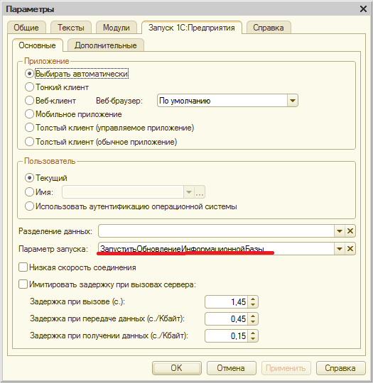

# Установка модуля обмена

**Навигация**
- [← Оглавление курса](index.md)
- [← Предыдущий: 25924 — Просмотр идентификаторов Битрикс24 элементов смарт-процессов](lesson_25924.md)
- [Следующий: 6692 — Общая панель модуля обмена →](lesson_6692.md)

Официальная страница урока: https://dev.1c-bitrix.ru/learning/course/index.php?COURSE_ID=48&LESSON_ID=6721

В данном уроке рассмотрим порядок установки

			модуля обмена

                    Модули для выгрузки кадровой информации и просмотра расчетных листков.
[Подробнее...](https://1c.1c-bitrix.ru/intranet/download.php#tab-zup-link)

		 в **1С:Зарплата и управление персоналом**, ред. **3.0**:

- Установите скаченный дистрибутив модуля обмена согласно прилагаемой к нему инструкции.
- Запустите систему **1С:Предприятие** в режиме **Конфигуратор**.
- Сделайте архивную копию информационной базы. Для этого в меню **Администрирование** выберите пункт **Выгрузить информационную базу**:
  
  Затем в открывшемся диалоге укажите имя файла, в который будут записаны данные.
- Откройте конфигурацию (Конфигурация &gt; Открыть конфигурацию).
- Включите возможность изменения объектов конфигурации (Конфигурация &gt; Поддержка &gt; Настройка поддержки, в открывшемся окне нажмите кнопку **Включить возможность изменения**).
- В окне **Настройка правил поддержки** выберите дважды **Объект поставщика редактируется с сохранением поддержки** и нажмите кнопку **ОК**.
- Сохраните конфигурацию.
- Вызовите режим **Сравнить, объединить с конфигурацией из файла** из меню **Конфигурация**. В этом режиме будут показаны только различающиеся объекты дополнения и используемой конфигурации, поэтому полностью идентичные объекты могут отсутствовать в окне сравнения-объединения. Также может отсутствовать флажок включения таких объектов в объединение.
- В диалоге выбора укажите файл конфигурации **XXX.cf**. По умолчанию он лежит по следующему адресу: **C:\Users\...\AppData\Roaming\1C\1Cv82\tmplts\1С-Битрикс\ОбменССайтом\(конфигурация 1С)**.
- Исключите из объединения все объекты конфигурации.
- Нажмите кнопку **Действия**, затем **Отметить по подсистемам файла**. Отобразится окно, в котором будут все подсистемы модуля обмена:
  **Важно!** Обязательно должна быть отмечена опция
  			Включать объекты родительских подсистем
                      
  		.

  - если нужен функционал экспорта кадровой информации, то установите флаг **ЭкспортКадровойИнформации**;
  - если нужен функционал просмотра расчетных листков и остатков отпуска на КП, то установите флаг **ВебСервисРасчетныхЛистков**;
  - если нужен функционал отправки сообщений в живую ленту на КП, то установите флаг **ВыгрузкаВЖЛ**.
- Включите в объединение (установите флажок)
  			подсистему **Битрикс**
                      
  		: Конфигурация &gt; Общие &gt; Подсистемы &gt; Администрирование &gt; Битрикс.
- Выполните сравнение и объединение конфигураций (кнопка **Выполнить**).
- Сохраните конфигурацию и обновите конфигурацию базы данных (Конфигурация &gt; Обновить конфигурацию базы данных).
- Запустите 1С с параметром **ЗапуститьОбновлениеИнформационнойБазы** для того, чтобы 1С заполнил все служебные данные в 1С. Запуск с параметром осуществите через командную строку или из конфигуратора.
  Из конфигуратора запустите 1С: Предприятие. Отладка &gt; Начало отладки. После обновления информационной базы 1С нужно очистить этот параметр запуска, чтобы он каждый раз не запускался.

  - чтобы запустить из командной строки, укажите следующие параметры:
    "&lt;Адрес к 1cv8.exe&gt;" ENTERPRISE (/F или /S в зависимости от типа базы) ""&lt;Адрес к базе&gt; " /N"&lt;Логин&gt;" /P"&lt;Пароль&gt;" /C ЗапуститьОбновлениеИнформационнойБазы
  - чтобы запустить из конфигуратора, откройте Сервис &gt; Параметры. На вкладке **Запуск 1С:Предприятия** укажите
    			параметр запуска
                        
    		.
