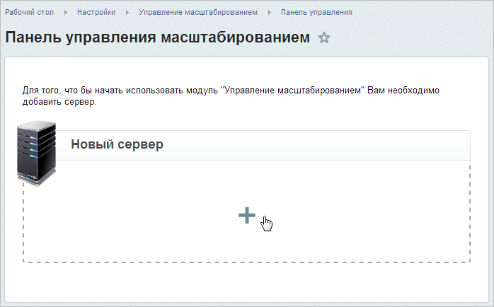
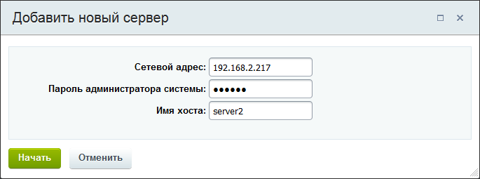
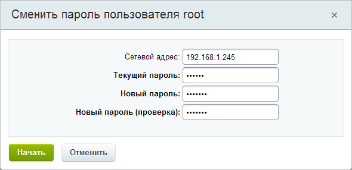

# Добавление нового сервера

**Навигация**
- [← Оглавление курса](index.md)
- [← Предыдущий: 1943 — Управление масштабированием](lesson_1943.md)
- [Следующий: 6724 — Глобальные действия →](lesson_6724.md)

Официальная страница урока: https://dev.1c-bitrix.ru/learning/course/index.php?COURSE_ID=48&LESSON_ID=6723

**Внимание**. Модуль Управление масштабированием (scale) устарел и больше не поддерживается.

### Добавление сервера на локальной машине

Для добавления новых серверов в пул нужно кликнуть на область

			Новый сервер

                    

		, указать сетевой адрес, пароль пользователя **root** и имя хоста добавляемого сервера:

**Внимание!** Если на подключаемом сервере, работающем на одном из специальных [Битрикс VM-решений](http://www.1c-bitrix.ru/products/vmbitrix/), не был сменен пароль по умолчанию для **root**, то

			система предложит это сделать

                    

		.

После этого нужно будет повторно ввести данные сервера для включения его в пул.

### Добавление сервера на хостинге

Если виртуальная машина или окружение «1C-Битрикс» уже настроены и располагаются на площадке провайдера, то в меню добавления сервера появится возможность выбора сервера из предлагаемых хостером:

Далее уже можно отслеживать статусы вашего заказа у провайдера на странице

			Список заказов VPS

                    В разделе Список заказов VPS осуществляется просмотр заказов серверов от партнеров «1С-Битрикс», присоединенных в пул. Для заказа сервера у провайдера нужно при добавлении нового сервера в пул выбрать из списка нужного провайдера.

[Подробнее ...](lesson_6665.md)

		(Настройки &gt; Управление масштабированием &gt; Список заказов).
