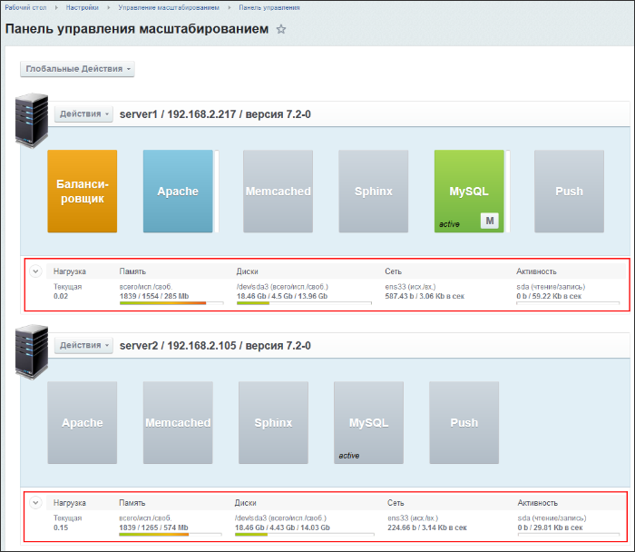
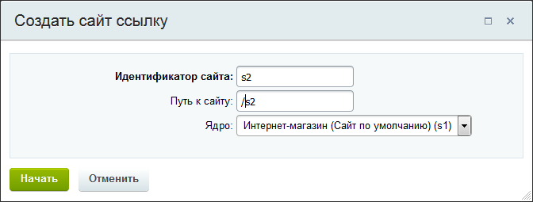
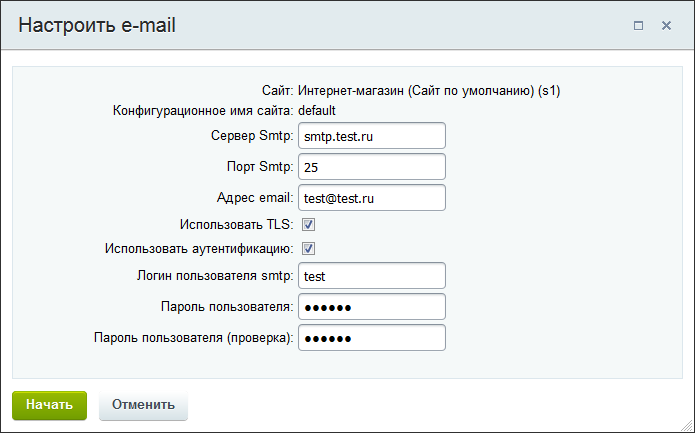

# Глобальные действия

**Навигация**
- [← Оглавление курса](index.md)
- [← Предыдущий: 6723 — Добавление нового сервера](lesson_6723.md)
- [Следующий: 6725 — Действия над сервером →](lesson_6725.md)

Официальная страница урока: https://dev.1c-bitrix.ru/learning/course/index.php?COURSE_ID=48&LESSON_ID=6724

**Внимание**. Модуль Управление масштабированием (scale) устарел и больше не поддерживается.

|  | ### Самые общие команды |
| --- | --- |

В меню

			Глобальные действия

                    

		 собраны команды, чьё действие распространяется на все серверы, входящие в пул:

  [Включить мониторинг](#monitor_on)
  [Добавить сайт](#add_new_site)
  [Удалить сайт](#del_site)
  [Настроить e-mail](#email_config)
  [Отключить cron](#cron_off)
  [Отключить http](#https_off)
  [Настройка сертификатов](#sertificate)
  [Команды обновлений](#env_update)

**Внимание!** Команды могут выполняться довольно длительное время (от одной минуты до 2-3 часов и более) в зависимости от сложности задачи, объема данных, используемых в этих задачах, мощности и загруженности сервера. Во время выполнения команды другой функционал будет недоступен, о чем будет

			выведено сообщение

                    

		.

|  | #### Включить мониторинг |
| --- | --- |

Пункт меню **Включить мониторинг** позволяет включить инструмент визуального мониторинга для каждого сервера в пуле:

**Примечание**: Подробные графики нагрузки для каждого сервера в пуле можно увидеть на странице

			Графики нагрузки

                    Чтобы посмотреть детальные графики нагрузок различных сервисов на каждом сервере, нужно перейти на страницу **Графики нагрузки** (Настройки &gt; Управление масштабированием &gt; Графики нагрузки), выбрать с помощью фильтра нужный сервер, категорию и период для вывода графиков:

[Подробнее ...](lesson_6664.md)

		.

|  | #### Добавить сайт |
| --- | --- |

Сайт можно добавлять как ссылку и как сайт на отдельном ядре. Сайт в виде ссылки подходит для большинства случаев. Сайт в виде отдельного ядра рекомендуется добавлять, если у вас много сайтов на одном ядре.

Для добавления сайта-ссылки

			нужно ввести

                    

		 **Ядро**,

			**Название сайта** и **Путь к сайту**

                    Поля **Название сайта** и **Путь к сайту** нужно заполнять латинскими буквами и цифрами.

Для добавления сайта на отдельном ядре нужно ввести

			дополнительные данные

                    

		 по типу сайта,  базе данных и кодировке сайта. Тип сайта **kernel** - это ядро с файлами веб конфигурации. Тип сайта **ext_kernel** - когда ядро расположено вне папки сайта и к нему обращаются по

			символическим ссылкам

                    Символическая ссылка (Symbolic link) - специальный файл в файловой системе, в котором вместо пользовательских данных содержится путь к файлу, открываемому при обращении к данной ссылке (файлу). [Символьные ссылки в многосайтовости](/learning/course/index.php?COURSE_ID=103&LESSON_ID=287).

		.

После отработки команды на сервере будет создана директория `/home/bitrix/ext_www/{путь к сайту}` с символическими линками на текущее ядро сайта и общей базой данных с основным сайтом (аналогично установке с ключом [link](/learning/course/index.php?COURSE_ID=37&CHAPTER_ID=08847) из меню *BitrixVM* v7.x).

|  | #### Удалить сайт |
| --- | --- |

При удалении нужно

			выбрать сайт

                    

		 из списка пула. После отработки команды сайт будет удален из системы.

**Внимание!** Мастер удаления дополнительного сайта удаляет папку `/home/bitrix/ext_www/{путь к сайту}` и базу данных дополнительного сайта, поэтому необходимо предварительно сделать бекап важных данных.

|  | #### Настроить e-mail |
| --- | --- |

Для настройки почты

			выберите сайт

                    

		 из списка пула и введите необходимые данные для smtp-сервера:

|  | #### Отключить cron |
| --- | --- |

Для отключения cron

			выберите сайт

                    

		 из списка пула. Теперь все события на данном сайте будут выполняться на агентах. Для включения cron для этого сайта используйте появившейся пункт меню **[Установить cron]**.

|  | #### Отключить http |
| --- | --- |

По умолчанию доступ к сайтам разрешен по протоколам **http** и **https**. Для отключения протокола **http** просто

			выберите сайт

                    

		 из списка пула. Теперь все данные на сайте будут передаваться только по защищенному протоколу **https**.

Чтобы включить снова  **http** для этого сайта, выберите появившейся пункт меню **Включить http**

|  | #### Настройка сертификатов |
| --- | --- |

Для настроек сертификатов выберите

			тип сертификата и сайт

                    

		, для которого устанавливается сертификат. Далее введите необходимые данные для

			самоподписного

                    

		 либо

			Let's Encrypt

                    

		 сертификата.

|  | #### Команды обновлений |
| --- | --- |

Команды

			обновлений

                    

		:

- **Обновить Битрикс окружение** — обновление серверного ПО *«Битрикс Веб-окружения»* одновременно на всех серверах пула.
- **Обновить систему на серверах** — обновление одновременно на всех серверах пула как серверного ПО, так и 1С-Битрикс.

**Внимание!** Обновления - сложная операция, в процессе которой происходит обновление системных файлов операционной системы сервера. Перед запуском обновления рекомендуется сделать полный бекап.
