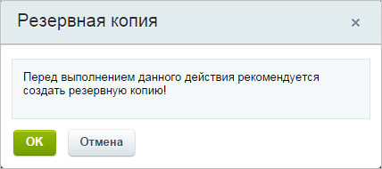

# Роли

**Навигация**
- [← Оглавление курса](index.md)
- [← Предыдущий: 6664 — Графики нагрузки](lesson_6664.md)
- [Следующий: 6665 — Список заказов →](lesson_6665.md)

Официальная страница урока: https://dev.1c-bitrix.ru/learning/course/index.php?COURSE_ID=48&LESSON_ID=6736

**Внимание**. Модуль Управление масштабированием (scale) устарел и больше не поддерживается.

### Службы сервера

Ролями в модуле **Масштабирования** являются службы сервера:

- **Apache** - веб-сервер;
- **Memcached** - кеширование данных;
- **MySQL** - база данных;
- **Sphinx** - полнотекстовый поиск;
- **Push** - отправка push-уведомлений.

**Примечание**: На главном сервере пула есть еще одна роль - **Балансировщик**, которая является системной и управляет всеми серверами и службами пула.

**Внимание!** Перед созданием ролей необходимо поменять пароль виртуальной машины. Часть операций (например, создание роли Apache вообще не может быть выполнена без смены пароля.)

### Добавление, удаление роли

При наведении указателя мыши на роль всплывет меню, в котором можно

			Добавить роль

                    

		. После того, как отработает мастер добавления ролей (это может занять продолжительное время), страница загрузится и будет показана выбранная роль на данном сервере:

Аналогично можно

			Удалить роль

                    

		.

### MySQL

При создании роли **MySQL slave** система

			предложит создать

                    

		 резервную копию базы данных. Если согласиться, то откроется страница

			Резервного копирования

                    Выполняется резервное копирование на странице Резервное копирование (Настройки &gt; Инструменты &gt; Резервное копирование).

[Подробнее ...](lesson_5330.md)

		; если выбрать **Отмена**, то создание роли **MySQL slave** будет продолжено.

После добавления роли **MySQL**, эта база будет выполнять роль slave-базы. Чтобы изменить роль **MySQL slave** на **MySQL master**, нужно выбрать **Сделать мастером** в меню действий роли **MySQL slave**:

В этом же меню с помощью соответствующих команд можно либо остановить сервис, либо сменить пароль Mysql.

### Важно помнить!

В инструменте **Масштабирование** описанными выше несложными манипуляциями создаётся пул серверов с нужными ролями, мониторингом и распределением нагрузки.

**Внимание!** Команды могут выполняться довольно длительное время (от одной минуты до 2-3 часов и более) в зависимости от сложности задачи, объема данных, используемых в этих задачах, мощности и загруженности сервера. Во время выполнения команды другой функционал будет недоступен, о чем будет

			выведено сообщение

                    

		.
