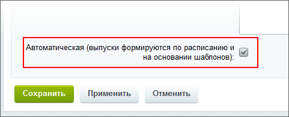
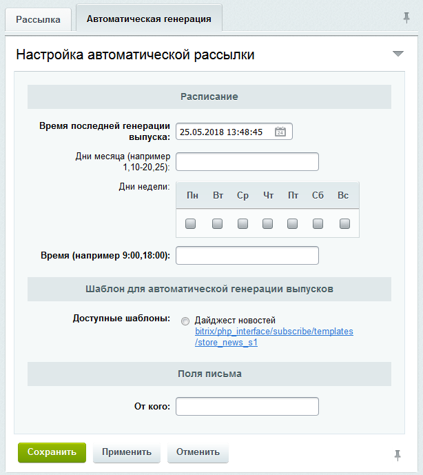
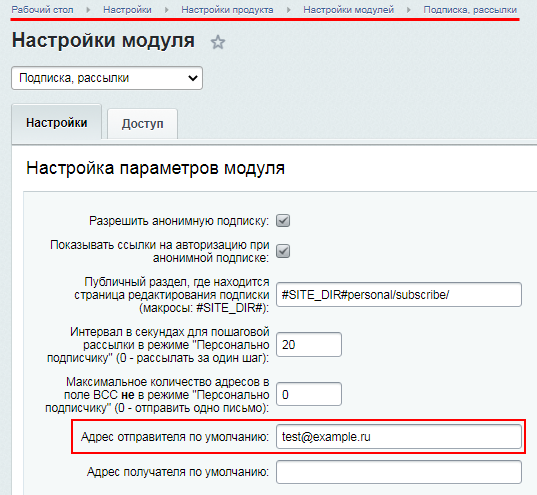

# Как создать автоматическую рассылку

**Навигация**
- [← Оглавление курса](index.md)
- [← Предыдущий: 5173 — Импорт адресов](lesson_5173.md)
- [Следующий: 1948 — Просмотр выпуска →](lesson_1948.md)

Официальная страница урока: https://dev.1c-bitrix.ru/learning/course/index.php?COURSE_ID=48&LESSON_ID=6759

Создание ручной и автоматических рассылок различаются, хотя начало у них общее.

### Видеоурок

### Как создать автоматическую рассылку

Чтобы генерация и отправка выпусков выполнялись в автоматическом режиме, при

			создании рассылки

                    Как создать ручную рассылку.
[Подробнее...](/learning/course/index.php?COURSE_ID=48&LESSON_ID=6761)

		 в форме создания рассылки нужно установить флаг в поле

			Автоматическая

                    

		. После этого станет доступна закладка **Автоматическая генерация**, на которой указывается следующее:

- **Расписание**, по которому будут выполняться генерация и отправка сообщений рассылки.
- **Шаблон**, на основе которого будут генерироваться выпуски (сообщения) рассылки. В
  			шаблоне
  В каждом дистрибутиве продукта есть образец шаблона рассылки. Как любая универсальная вещь, он нуждается в адаптации шаблона под конкретный сайт. Администратор может отредактировать шаблон по умолчанию или создать свой шаблон.
  [Подробнее](https://dev.1c-bitrix.ru/learning/course/index.php?COURSE_ID=41&LESSON_ID=4810) в курсе "Администратор. Модули"...
  		 определяется:

  - внешний вид сообщений;
  - информация, размещаемая в сообщении.
- **Адрес**, который будет подставляться в поле **От кого** отправляемых сообщений. По умолчанию поле имеет значение, заданное на странице настроек модуля
  			Подписка, рассылки
                      Модуль **Подписка и Рассылки** настраивается на странице
  Настройки &gt; Настройки продукта &gt; Настройки модулей &gt; Подписка и рассылки:
  
  		.

Подробнее о каждом из полей можно прочитать [в пользовательской документации](https://dev.1c-bitrix.ru/user_help/service/subscribe/rubric_edit.php).

После создания автоматической рассылки её выпуски будут автоматически генерироваться и рассылаться тем пользователям, которые

			подписаны

На рассылку можно подписать несколькими способами:

1) Автоматически подписать пользователей на рассылку при [импорте адресов](lesson_5173.md);

2) Разрешить пользователям [самостоятельно подписываться](lesson_2951.md) на рассылки и вывести

в публичной части сайта список доступных рассылок;

3) Вручную [подписать пользователя](lesson_2951.md#admin) на рассылку на странице **Список подписчиков**

(Сервисы &gt; Рассылки &gt; Подписчики).

		 на эту рассылку.
