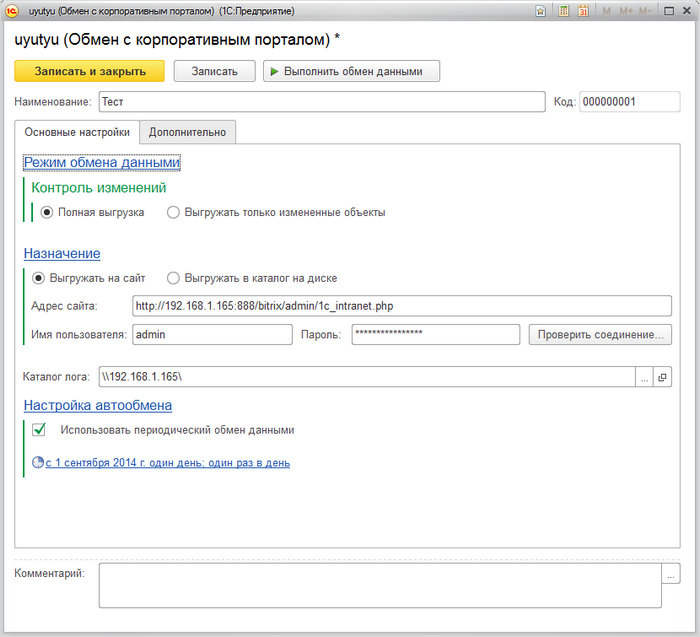
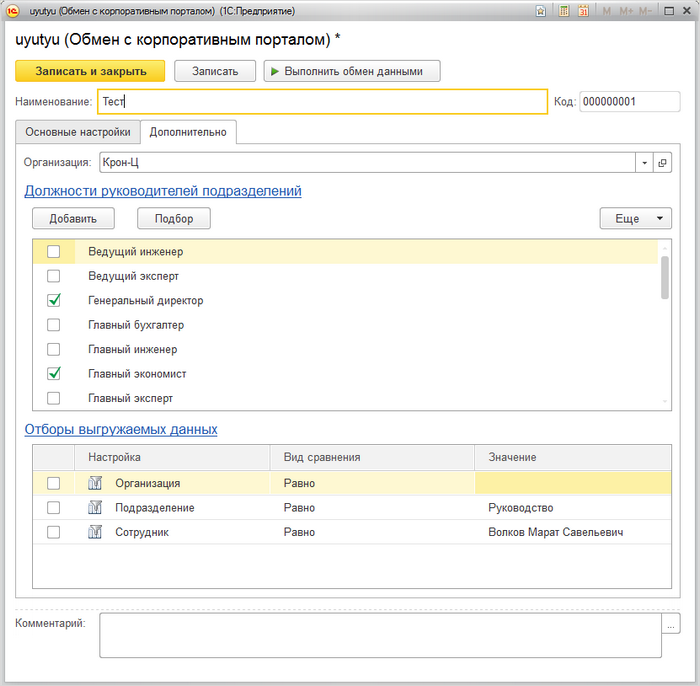

# Настройка экспорта кадровой информации

**Навигация**
- [← Оглавление курса](index.md)
- [← Предыдущий: 6655 — Узлы обмена](lesson_6655.md)
- [Следующий: 6813 — Настройки веб-сервиса 1С →](lesson_6813.md)

Официальная страница урока: https://dev.1c-bitrix.ru/learning/course/index.php?COURSE_ID=48&LESSON_ID=6812

### Форма создания/редактирования узла обмена

Форма создания/редактирования узла обмена имеет следующий вид:

**Наименование** и **Код** заполнятся автоматически при сохранении настройки. Но вы можете задать их вручную при необходимости.

На вкладке **Основные настройки** задаются базовые настройки параметров обмена:

**Режим обмена данными (Контроль изменений)**

- Если выбрана **Полная выгрузка**, тогда выгружаться из 1С будут все данные, удовлетворяющие заданным отборам. Если данных в базе много, то обмен может выполняться продолжительное время.
- При отмеченной опции **Только изменения** будут выгружаться только те данные, которые изменились. В этом случае скорость обмена существенно повышается.

**Назначение**

- При выборе опции **Выгружать на сайт** данные будут выгружаться на портал, настройки подключения к которому задаются в соответствующих полях:
  При нажатии на кнопку **Проверить соединение**, происходит проверка подключения к порталу.

  - **Адрес сайта** – адрес вашего портала, содержащий путь до файла `/bitrix/admin/1c_intranet.php`.
  - **Пользователь** – логин пользователя портала (пользователь должен обладать правом на выполнение обмена данными).
  - **Пароль** – пароль пользователя.
- Если отмечена опция **Выгружать в каталог на диске**, то данные будут выгружаться в каталог на диске.

В поле **Каталог лога** задается каталог, в котором будет храниться лог-файл обмена. Логи хранятся в разрезе дня в подчиненной папке **reports**.

### Настройка автообмена

Если отмечена опция **Использовать периодический обмен данными** то обмен будет выполняться по заданному расписанию. В зависимости от того, база 1С в файловом или клиент-серверном варианте, настройка автообмена отличается.

При установке флажка автоматически откроется форма настройки расписания обмена, в которой задается время начала и завершения обмена, дата начала и дата завершения, периодичность.

На вкладке **Дополнительно** устанавливаются отборы выгружаемой кадровой информации:

В поле **Организация** указывается, из какой организации экспортируются данные. Поле должно быть заполнено.

В списке **Должности руководителей подразделений** указывается, какие должности являются начальниками выгружаемых отделов. Данные необходимы для идентификации руководителей подразделений.

В таблице значений **Отборы выгружаемых данных** указываются отборы экспортируемой информации.

### Выполнение экспорта кадровой информации

Автоматическая выгрузка кадровой информации осуществляется в соответствии с [настройками автообмена](#auto). Для ручного запуска процесса выгрузки необходимо:

- в форме создания/редактирования настройки обмена нажать кнопку **Выполнить обмен данными**;
- либо в форме списка узлов обмена выбрать нужный узел и нажать пункт **Выполнить обмен данными** в меню кнопки **Синхронизация данных**.
