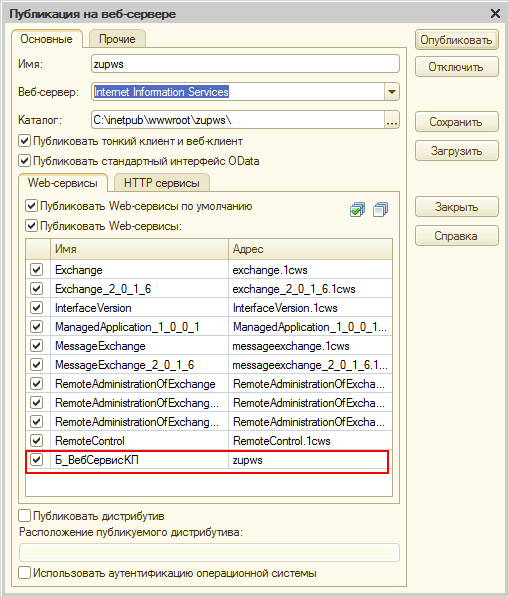

# Настройки веб-сервиса 1С

**Навигация**
- [← Оглавление курса](index.md)
- [← Предыдущий: 6812 — Настройка экспорта кадровой информации](lesson_6812.md)
- [Следующий: 6814 — Настройки в корпоративном портале →](lesson_6814.md)

Официальная страница урока: https://dev.1c-bitrix.ru/learning/course/index.php?COURSE_ID=48&LESSON_ID=6813

Для функционала требуется web-сервис 1С.

URL web-сервиса  указывается при публикации из 1С. Подробно публикация web-сервисов описана в документации к 1С. Кратко о необходимых действиях (нужен доступ в **Конфигуратор** и административные права):

- Откройте пункт меню Администрирование &gt; Публикация на веб-сервере:
  
- Установите флажки на тех веб-сервисах, которые нужны. Web-сервис, который используется для расчетных листков называется **Б_ВебСервисКП**.
- Нажмите кнопку **Опубликовать**.
  В показанном выше примере нужный нам далее URL такого вида: http://(адрес к серверу)/zupws/ws/zupws.
- Помимо этого нужно настроить права пользователя, который будет отвечать за работу нашего web-сервиса для работы с корпоративным порталом. Нужно создать или отредактировать пользователя, добавив ему роль **Роль для корпоративного портала**.

**Примечание**: В IIS, где размещен сервер 1С и опубликована база 1С, должна быть включена только windows-аутентификация.
