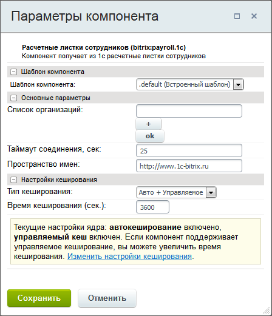

# Настройки в корпоративном портале

**Навигация**
- [← Оглавление курса](index.md)
- [← Предыдущий: 6813 — Настройки веб-сервиса 1С](lesson_6813.md)
- [Следующий: 6815 — Выдача кодов активации сотрудникам →](lesson_6815.md)

Официальная страница урока: https://dev.1c-bitrix.ru/learning/course/index.php?COURSE_ID=48&LESSON_ID=6814

Для настройки сервиса **Зарплата и отпуск** необходимо настроить компонент **Расчетные листки сотрудников** (

			bitrix:payroll.1c

						[Описание компонента «Расчетные листки сотрудников» в пользовательской документации.](http://dev.1c-bitrix.ru/user_help/detail.php?ID=482519)

		), размещенный на странице портала Сервисы &gt; Зарплата и отпуск.

Детальное описание полей дано в пользовательской документации по **Битрикс24 в коробке**. Минимально достаточная настройка заключается в следующем:

- В поле **Список организации** создайте новую организацию, если их несколько. Если организация одна, то можно просто переименовать имеющуюся по умолчанию. Обязательно нажмите на кнопку **ОК**. Форма перезагрузится.
- В группе полей **Настройки для организации ***** заполните поля:

  - **URL веб-сервиса** - адрес сервиса, полученный от администратора программы **1С:ЗУП** (см. урок [Настройки веб-сервиса 1С](lesson_6813.md)). Можно настроить таким образом, чтобы разные организации подключались к разным базам 1С;
  - **Порт** - порт сервиса, полученный от администратора программы **1С:ЗУП**;
  - **Логин** и **Пароль** пользователя 1С, от имени которого будет производиться доступ к программе **1С:ЗУП**.
- Сохраните внесенные изменения.
