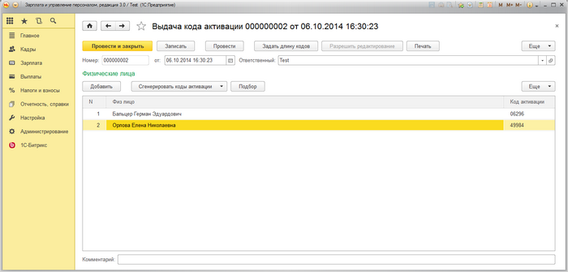
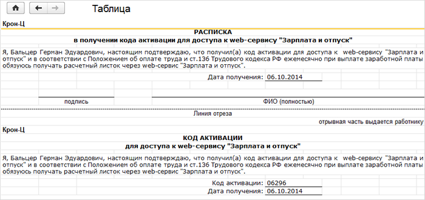

# Выдача кодов активации сотрудникам

**Навигация**
- [← Оглавление курса](index.md)
- [← Предыдущий: 6814 — Настройки в корпоративном портале](lesson_6814.md)
- [Следующий: 6816 — Формирование расчетных листков и остатков отпуска сотрудникам →](lesson_6816.md)

Официальная страница урока: https://dev.1c-bitrix.ru/learning/course/index.php?COURSE_ID=48&LESSON_ID=6815

Выдача кода активации сотрудникам производится в документе **Выдача кода активации**. Активируется код в корпоративном портале, в результате чего сотрудник получает ПИН-код, с помощью которого можно посмотреть сформированные расчетные листки и остатки отпуска. Активировать код можно всего лишь один раз. Для повторной активации кода необходимо снова создавать новый документ выдачи кодов активации.

Форма со списком документов выдачи кодов активации доступна по следующему адресу: 1С-Битрикс &gt; Веб сервис расчетных листков &gt; Документы выдачи кода активации:

При нажатии на кнопку **Задать длину кодов** появляется форма, где задается длина кодов для кода активации и ПИН-кода.

Если документ уже был создан и проведен, то его нельзя изменить, пока не нажата кнопка **Разрешить редактирование**.

В табличной части **Физические лица** указываются сотрудники, которые должны получить код активации. Сотрудников можно добавить в таблицу как вручную, так и с помощью подбора, форма которого открывается при нажатии на кнопку **Подбор**.

Код активации генерируется автоматически при добавлении сотрудника. Но и можно его сгенерировать автоматически как для выделенного сотрудника, так и для всех в табличной части сразу.

При нажатии на кнопку **Печать** будет сформирован табличный документ с распиской в получении кода активации:

