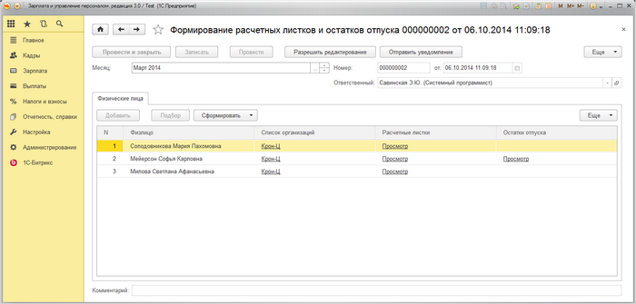

# Формирование расчетных листков и остатков отпуска сотрудникам

**Навигация**
- [← Оглавление курса](index.md)
- [← Предыдущий: 6815 — Выдача кодов активации сотрудникам](lesson_6815.md)
- [Следующий: 6817 — Журнал запросов Веб-Сервиса 1С-Битрикс →](lesson_6817.md)

Официальная страница урока: https://dev.1c-bitrix.ru/learning/course/index.php?COURSE_ID=48&LESSON_ID=6816

Формирование расчетных листков и остатков отпуска сотрудников производится в документе **Формирование расчетных листков и остатков отпуска**. Для физического лица всего 1 раз в месяц может быть сформирован расчетный листок и остаток отпуска.

Форма со списком документов формирования расчетных листков и остатка отпусков доступна по следующему адресу: 1С-Битрикс &gt; Веб сервис расчетных листков &gt; Документы формирования расчетных листков и остатков отпуска:

Если документ уже был создан и проведен, то его нельзя изменить, пока не нажата кнопка **Разрешить редактирование**.

При нажатии на кнопку **Отправить уведомление** будет отправлено сообщение в живую ленту портала о том, что расчетные листки и остатки отпуска сформированы.

В табличной части **Физические лица** указываются физические лица, для которых нужно сформировать расчетные листки или остатки отпуска.  Физические лица можно добавить в таблицу как вручную, так и с помощью подбора, форма которого открывается при нажатии на кнопку **Подбор**.

В колонке **Список организаций** указывается для каких организаций нужно сформировать данные.

При нажатии на кнопку **Сформировать** высвечивается всплывающее меню с командами, при нажатии которых формируются расчетные листки и остатки отпуска, как для выбранного сотрудника, так и для всех сразу.

Если в колонке **Расчетные листки** или **Остатки отпуска** появилась ссылка **Просмотр**, тогда при нажатии на эту ссылку можно посмотреть сформированный расчетный листок или остаток отпуска.
