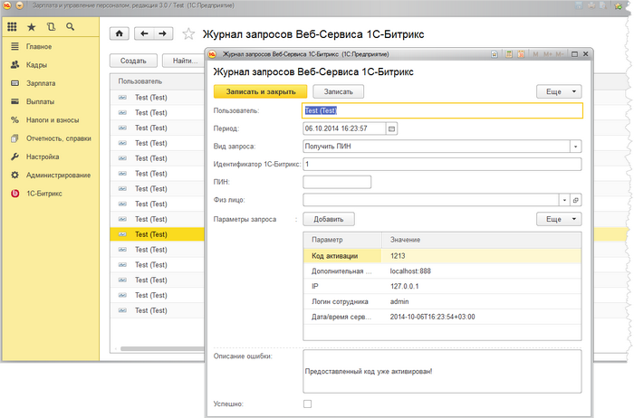

# Журнал запросов Веб-Сервиса 1С-Битрикс

**Навигация**
- [← Оглавление курса](index.md)
- [← Предыдущий: 6816 — Формирование расчетных листков и остатков отпуска сотрудникам](lesson_6816.md)
- [Следующий: 6821 — Настройки в корпоративном портале →](lesson_6821.md)

Официальная страница урока: https://dev.1c-bitrix.ru/learning/course/index.php?COURSE_ID=48&LESSON_ID=6817

Журнал запросов Веб-Сервиса 1С-Битрикс необходим для просмотра и анализа запросов из корпоративного портала в 1С.

