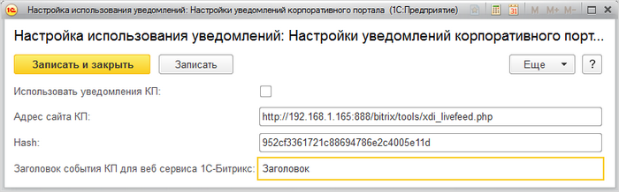

# Настройки со стороны 1С

**Навигация**
- [← Оглавление курса](index.md)
- [← Предыдущий: 6821 — Настройки в корпоративном портале](lesson_6821.md)
- [Следующий: 6823 — Отправка сообщений в живую ленту →](lesson_6823.md)

Официальная страница урока: https://dev.1c-bitrix.ru/learning/course/index.php?COURSE_ID=48&LESSON_ID=6822

Чтобы настроить работу с живой лентой портала, следует выполнить настройки в форме использования уведомлений (1С-Битрикс &gt; Сервис &gt; Настройки уведомлений корпоративного портала):

- При отмеченной опции **Использовать уведомления КП** можно будет отправлять сообщение в живую ленту из документа формирования расчетных листков и отпусков, о том, что расчетные листки сформированы и их можно посмотреть на КП.
- В поле **Адрес сайта КП** задается адрес, на который отсылается сообщение. Как правило он следующего формата: http://*адрес_сайта*/bitrix/tools/xdi_livefeed.php.
- Поле **Hash** хранит хеш авторизации, чтобы портал разрешил импорт данных.
- Поле **Заголовок события КП для веб сервиса 1С-Битрикс** хранит название заголовка сообщения, которое отправляется в живую ленту портала, когда из 1С отправляется уведомление о том, что расчетные листки и отпуска сформированы.
