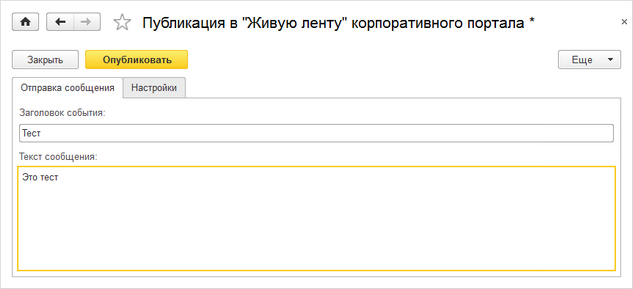
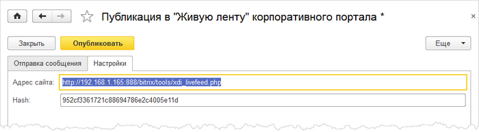

# Отправка сообщений в живую ленту

**Навигация**
- [← Оглавление курса](index.md)
- [← Предыдущий: 6822 — Настройки со стороны 1С](lesson_6822.md)
- [Следующий: 15304 — Нагрузочное тестирование 2015 →](lesson_15304.md)

Официальная страница урока: https://dev.1c-bitrix.ru/learning/course/index.php?COURSE_ID=48&LESSON_ID=6823

Форма для отправки сообщений в живую ленту корпоративного портала доступна по следующему адресу: 1С-Битрикс &gt; Сервис &gt; Публикация в "Живую ленту" корпоративного портала.

На закладке **Отправка сообщения** указываются:

- в поле **Заголовок сообщения** - заголовок сообщения, которое отобразится в живой ленте на портале;
- в поле **Текст сообщения** - само сообщение.

На закладке **Настройки** устанавливаются настройки для отправки сообщений в живую ленту:

По умолчанию настройки берутся из констант, которые устанавливаются в форме

			Настройки уведомлений корпоративного портала

                    

		, но при необходимости их можно отредактировать в самой форме отправки сообщений.
