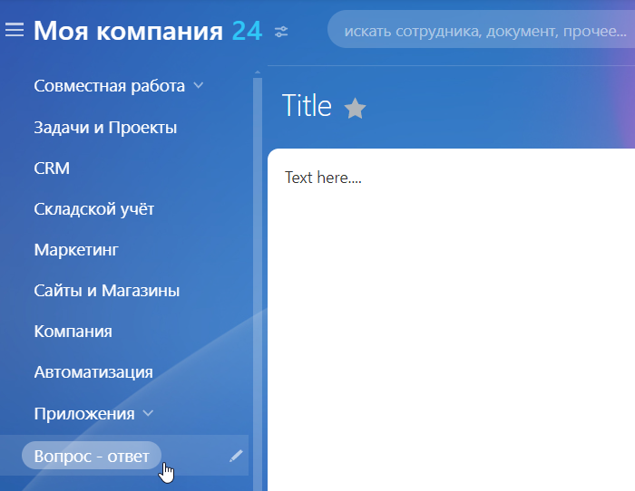

# Раздел на сайте для Вопросов и ответов

**Навигация**
- [← Оглавление курса](index.md)
- [← Предыдущий: 5311 — Почтовый шаблон](lesson_5311.md)
- [Следующий: 5313 — Список вопросов и ответов →](lesson_5313.md)

Официальная страница урока: https://dev.1c-bitrix.ru/learning/course/index.php?COURSE_ID=48&LESSON_ID=6836

|  | #### Создаём структуру |
| --- | --- |

Создайте отдельный [раздел](lesson_2021.md) `Вопрос - ответ` (имя папки - `/question_answer`) для публичных страниц системы, например, на верхнем уровне, и разместите его в меню:

[Создайте](lesson_2021.md) в папке `/question_answer` страницы:

- Вопрос - ответ (название файла **index.php**) –
  			главная страница раздела
                      Она создается автоматически, если создание раздела выполняется с помощью мастера.
  		 со списком вопросов и ответами на них.
- Задать вопрос (название файла **ask_question.php**) – страница создания нового вопроса. На ней будет заполняться веб-форма.
- Ваш вопрос принят (название файла **mess_send.php**) – здесь будет размещено сообщение об успешном создании нового вопроса. Сюда пользователь будет перенаправляться после заполнения формы на странице Задать вопрос.
- Дать ответ (название файла **answer.php**) – страница составления ответа. На ней будет выводиться форма редактирования результата заполнения веб-формы.

Осталось разместить на этих страницах компоненты и настроить их на работу.
