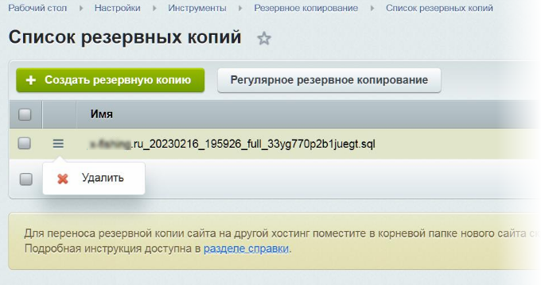
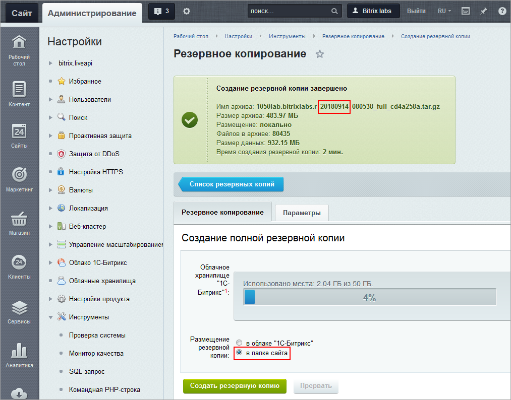
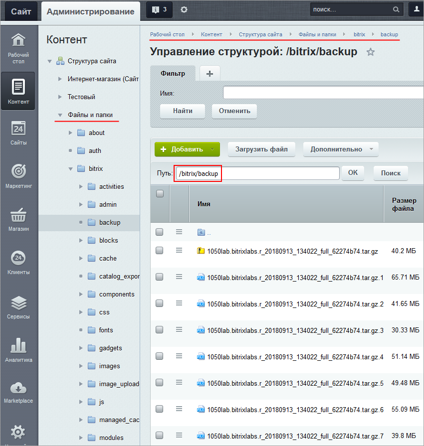
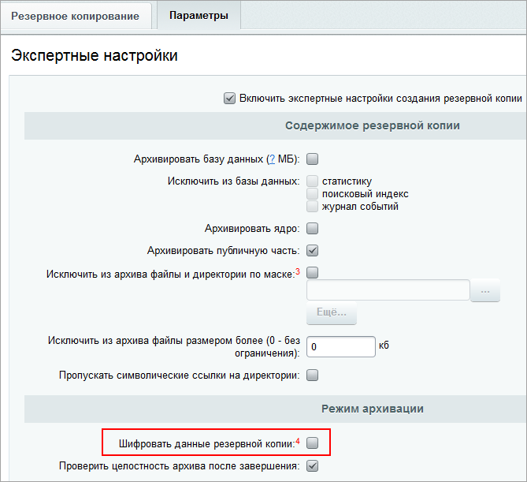
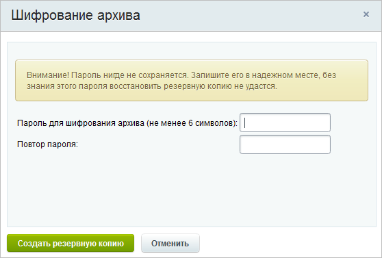

# Хранение и шифрование резервных копий

**Навигация**
- [← Оглавление курса](index.md)
- [← Предыдущий: 5330 — Создание резервной копии](lesson_5330.md)
- [Следующий: 4464 — Регулярное резервное копирование →](lesson_4464.md)

Официальная страница урока: https://dev.1c-bitrix.ru/learning/course/index.php?COURSE_ID=48&LESSON_ID=7080

### Где хранить бэкапы

Где хранить бэкапы сайта - на локальном компьютере, в облаке 1С-Битрикс или в сторонних облачных хранилищах, обычно решает администратор в соответствии с политикой компании. А CMS "1С-Битрикс" обеспечивает все эти возможности.

В списке резервных копий (Настройки &gt; Инструменты &gt; Резервное копирование &gt; Список резервных копий) отмечено, является ли бэкап локальным или облачным. И действия, доступные в контекстом меню, также отличаются:

**Примечание**. При создании архивной копии могут возникнуть разные ошибки. В ряде случаев при этом создаётся файл не со

			стандартным расширением

                    Расширения бекапов.

Сжатие отключено:

- .tar (без шифрования);

- .enc (с шифрованием).

Сжатие включено:

- .tar.gz (без шифрования);

- .enc.gz (с шифрованием).

		, а, например, с расширением **sql**. В таких случаях доступна будет только одна команда действия с таким архивом: **Удалить**. Вам следует удалить такой архив и создать его заново.

### Локальный бэкап

Для сохранения на локальный носитель надо на закладке **Резервное копирование** выбрать опцию **в папке сайта** и нажать кнопку **Резервное копирование**. Архив создастся и сохранится. В имени файла будет содержаться дата создания.

В рамках файловой структуры сайта

			файлы копий хранятся

                    

		 в папке `/bitrix/backup`.

### Облачный бэкап

Можно хранить резервную копию в любом стороннем облачном хранилище или в облачном хранилище, предоставляемом компанией *"1С-Битрикс"*. В обоих случаях необходимы:

- установленный модуль
  			Облачные хранилища (clouds)
                      **Облачное хранилище** — это вариант хранения данных - недорогой, очень распространенный и уже привычный многим пользователям Интернета, особенно мобильного. Данные хранятся на многочисленных серверах, расположенных в сети. Причем физически и географически они могут находиться весьма удалённо друг от друга, вплоть до разных континентов. А с точки зрения клиента, его файлы лежат где-то на одном большом виртуальном сервере и доступны везде, где есть интернет. Доступ к ним предоставляется провайдером, поставщиком таких услуг.
  [Читать подробнее...](https://dev.1c-bitrix.ru/learning/course/index.php?COURSE_ID=35&CHAPTER_ID=011629)
  		,
- подключённое какое-либо хранилище.

Если используется копирование в облако *"1С-Битрикс"*, то дополнительно необходимы:

- активный коммерческий лицензионный ключ,
- установленный модуль **Облако 1С-Битрикс** (bitrixcloud).
  **Примечание.** Облако  *1С-Битрикс* физически размещается на следующих серверах:
  - Яндекс (Yandex Object Storage) — для лицензий, купленных в России, Беларуси и Казахстане,
  - Amazon S3 (Simple Storage Service) — для остальных стран.
  Оно обладает всеми возможностями по безопасности и производительности соответствующих облачных сервисов.

**Примечание**: Хранение бэкапа в облаке *1С-Битрикс* не требует оплаченного и подключённого стороннего облачного хранилища. Однако объем хранимой информации ограничен:

- «1С-Битрикс: Управление сайтом» - Старт, Стандарт: 2 Гб;
- «1С-Битрикс: Управление сайтом» - Малый бизнес: 4 Гб;
- «1С-Битрикс: Управление сайтом» - Бизнес: 10 Гб;
- "Интернет-магазин + CRM": 15 Гб;
- «Битрикс24 в коробке» - Корпоративный портал: 20 Гб;
- «Битрикс24 в коробке» - Энтерпрайз: 60 Гб.

В облаке *1С-Битрикс* будут храниться только 3 файла бэкапа, более ранние по времени будут удаляться автоматически. При нехватке места будет удалена самая ранняя копия (или все копии, если будет недостаточно места для сохранения новой).

В других облачных хранилищах число файлов бэкапа зависит от места, имеющегося в вашем распоряжении. Если места в облаке не хватит, то для сохранения последней копии удалятся все предыдущие. Если не хватит места для сохранения единственной копии, то будет выведено предупреждение.

**Возможная ошибка**: при создании резервной копии в облачное хранилище дополнительно создаётся и локальная копия. Ошибка возникает потому, что файл не сразу отправляется в облако: сначала создается локально, потом идет проверка целостности, только после этого отправляется в облако. Если передача была успешна, локальный файл удаляется. Если возникла ошибка при передаче, то локальный файл остаётся.

**Примечания**:

1. Облако *1С-Битрикс* доступно пользователям с активной лицензией. Если лицензия закончилась, то файл бэкапа будет доступен в облаке *1С-Битрикс* в течение двух недель. Но восстановить резервную копию из облака можно только при наличии активного лицензионного ключа.
2. Если в силу каких-то причин (хакерская атака, сбой на хостинге и другие причины) был удалён сайт, то восстановить бекап из облака *1С-Битрикс* можно через нашу [ТП](http://www.1c-bitrix.ru/support/customers/ticket.php?show_wizard=Y). Для этого в обращении в техподдержку нужно указать активный лицензионный ключ.

### Шифрование

При хранении резервной копии в любом облачном хранилище требуется гарантия безопасности данных. Делается это с помощью шифрования. Для шифрования бэкапа в настройках на закладке **Параметры** должна быть

			включена опция

                    

		 **Шифровать данные резервной копии**.

При шифровании используется алгоритм openssl_encrypt.

**Примечание**: при размещении резервной копии в облачном хранилище *"1С-Битрикс"* отключить шифрование нельзя.

**Внимание!** Пароль пользователя не хранится в системе *Bitrix Framework* или в компании *"1С-Битрикс"*. При создании бэкапа на сервер компании *"1С-Битрикс"* передается только хеш пароля пользователя, который позволяет проверить корректность пароля, но не дает возможности распаковать архив.

Компания *"1С-Битрикс"* не может восстановить или поменять пароль! Будьте внимательны, без знания этого пароля восстановить бэкап не удастся! Восстановить сайт из бекапа при утере пароля техподдержка *"1С-Битрикс"* также не может.

Список резервных копий привязывается к лицензионному ключу (для многосайтовой установки облачное хранилище будет общее). Если даже произошла "утечка" ключа в чужие руки, то невозможно переполнить хранилище этого ключа: записывать резервные копии можно только с оригинальной установки (допускается еще одна копия для разработки). Повторный ввод ключа блокирует запись бэкапа.

Если шифрование включено, то перед началом создания резервной копии появится

			окно для ввода пароля

                    

		. Рекомендуем, чтобы пароль содержал не менее 6 знаков и использовал спецсимволы.

**Примечание**: для каждой резервной копии можно задать свой отдельный пароль.

После задания пароля продолжится создание резервной копии.

Резервную копию из облака *"1С-Битрикс"* можно только восстановить.

Из стороннего облачного хранилища архив можно скачать на локальный носитель. Помните, что место в стороннем облаке также ограничено вашим тарифным планом.
