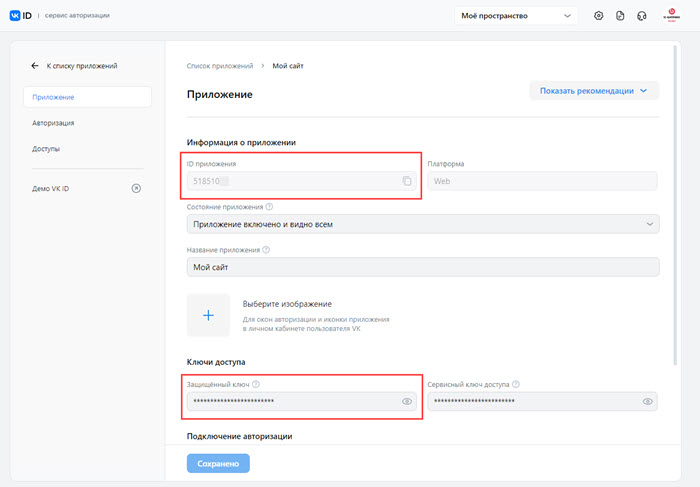

# ВКонтакте

**Навигация**
- [← Оглавление курса](index.md)
- [← Предыдущий: 7288 — Box.com](lesson_7288.md)
- [Следующий: 7134 — Мой Мир@mail.ru →](lesson_7134.md)

Официальная страница урока: https://dev.1c-bitrix.ru/learning/course/index.php?COURSE_ID=48&LESSON_ID=7133

|  | ### ВКонтакте |
| --- | --- |

Чтобы пользователи могли авторизоваться на вашем сайте с помощью своей учётной записи сервиса ВКонтакте, выполните следующие действия:

1. Создайте **приложение ВКонтакте**. Для этого пройдите по [ссылке](https://id.vk.com/about/business/go) на сайт ВКонтакте.
  **Примечание.** Если вы создаёте приложение впервые, то сначала автоматически запустится мастер создания бизнес-аккаунта. На
  			первом шаге
  
  		 выберите тип аккаунта (юридическое лицо, индивидуальный предприниматель или физическое лицо). Поля
  			второго шага
                      Пример второго шага для аккаунта типа **Индивидуальный предприниматель**:
  
  		 подставятся в зависимости от выбранного типа аккаунта – заполните их и нажмите кнопку **Создать аккаунт**.
  Если бизнес-аккаунт уже создан, то при переходе по указанной выше ссылке запустится мастер создания приложений. В этом мастере
  			выберите
  
  		 в качестве платформы вариант **Web**, а также
  			укажите
  
  		 **Базовый домен** вашего сайта (например, `mysite.ru`) и **Доверенный redirect URL** вида https://*ваш_сайт*/bitrix/tools/oauth/vkontakte.php.
  Нажмите кнопку **Готово**, и приложение будет создано. Далее перейдите в настройки созданного приложения и скопируйте данные из полей **ID приложения** и **Защищенный ключ**:
  )
  Чтобы просмотреть защищенный ключ, кликните по
  			значку
  
  		 справа от ключа. Вам потребуется подтвердить свои действия, указав код из отправленного смс-сообщения. После этого ключ можно будет скопировать.
2. В настройках модуля **Социальные сервисы** продукта «1С-Битрикс» (Настройки &gt; Настройки продукта &gt; Настройки модулей &gt; Социальные сервисы) отметьте в качестве внешнего сервиса платформу ВКонтакте, а чуть ниже вставьте скопированные ранее **ID приложения** и **Защищенный ключ**:
  

**Примечание.** Со временем социальные сервисы могут изменять внешний вид мастеров регистрации приложений. В уроках могут не отображаться последние изменения.
<!-- Пожалуйста, сообщайте нам о замеченных вами изменениях.  
	 Для отправки комментария воспользуйтесь расположенной в правом нижнем углу окна браузера кнопкой:&lt;img src="/images/curs_b24/comment_1.png"&gt; -->
