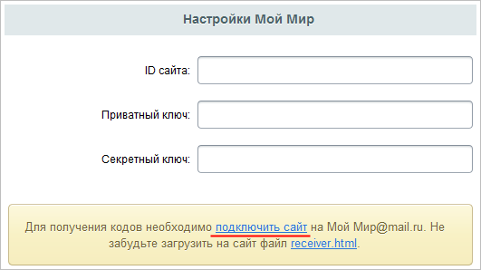
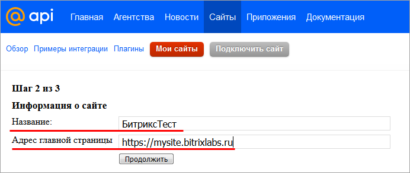

# Мой Мир@mail.ru

**Навигация**
- [← Оглавление курса](index.md)
- [← Предыдущий: 7133 — ВКонтакте](lesson_7133.md)
- [Следующий: 12846 — Mail.ru →](lesson_12846.md)

Официальная страница урока: https://dev.1c-bitrix.ru/learning/course/index.php?COURSE_ID=48&LESSON_ID=7134

|  | ### Мой Мир@mail.ru |
| --- | --- |

1. По
  			ссылке
  
  		 [подключить сайт](https://api.mail.ru/sites/my/add/) зарегистрировать свой сайт в системе api.mail.ru.
2. На
  			первом шаге
                      
  		 согласиться с правилами использования **Платформы@Mail.ru**.
3. На
  			втором шаге
                      
  		 задать название и адрес главной страницы вашего сайта.
4. Скачать файл
                      
  		 **receiver.html** по [одноименной ссылке](http://connect.mail.ru/receiver.html), загрузить на свой сайт и указать путь к нему:
  
5. Указать выданные сервисом **ID сайта**, **Приватный ключ**, **Секретный ключ** в соответствующих полях в
  			настройках
                       
  		 модуля **Социальные сервисы** продукта «1С-Битрикс» (Настройки &gt; Настройки продукта &gt; Настройки модулей &gt; Социальные сервисы):

**Примечание:**Со временем социальные сервисы могут изменять внешний вид мастеров регистрации приложений. В уроках могут не отображаться последние изменения. Пожалуйста, сообщайте нам о замеченных вами изменениях.

Для отправки комментария воспользуйтесь расположенной в правом нижнем углу окна браузера кнопкой:
