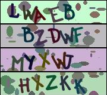

# Настройка CAPTCHA

**Навигация**
- [← Оглавление курса](index.md)
- [← Предыдущий: 2161 — Как восстановить доступ администратора на сайт](lesson_2161.md)
- [Следующий: 2836 — Подключение CAPTCHA →](lesson_2836.md)

Официальная страница урока: https://dev.1c-bitrix.ru/learning/course/index.php?COURSE_ID=48&LESSON_ID=7174

**Внимание!** Для работы CAPTCHA на сервере должна быть установлена библиотека **FreeType library** и **Библиотека GD (функции imagecreatetruecolor и imagejpeg)**. Проверить их наличие можно на странице

			Проверка системы

                    Форма Проверка системы (Настройки &gt; Инструменты &gt; Проверка системы) предназначена для всесторонней проверки соответствия параметров системы, на которой осуществляется функционирование проекта, минимальным и рекомендуемым техническим требованиям продукта.

[Подробнее ...](lesson_14020.md)

		.

|  | ### Настройка CAPTCHA |
| --- | --- |

Форма **Настройка CAPTCHA** (Настройки &gt; Настройки продукта &gt; CAPTCHA) предназначена для настройки защиты от

			автоматических регистраций

                    Несколько способов борьбы с автоматической регистрацией ботов.

[Подробнее ...](https://dev.1c-bitrix.ru/learning/course/index.php?COURSE_ID=35&LESSON_ID=3092)

		.

В поле **Профиль** можно выбрать уже готовые настройки или же можно вручную задать параметры отображения CAPTCHA в

			последующих полях

Форма **CAPTCHA** (*Настройки &gt; Настройки продукта &gt; CAPTCHA*) предназначена для настройки защиты от автоматических регистраций.

						[Описание компонента «CAPTCHA» в пользовательской документации.](http://dev.1c-bitrix.ru/user_help/detail.php?ID=132120)

		 .

CAPTCHA необходимо настраивать так, чтобы исключить, по возможности, автоматическое распознавание. Но необходимо искать компромисс между защитой от спама и неудобством для посетителей. Рекомендуемые параметры:

- прозрачность текста в процентах - 40-50%,
- угол отклонения от вертикали - от -30 до 30,
- добавить нелинейные искажения,
- шрифт
                      Возможна установка пользовательских шрифтов в папку `/bitrix/modules/main/fonts/`. Поддерживаются файлы шрифтов в формате ***.ttf**. Некоторые шрифты могут отображаться некорректно!
  		 лучше поменять на **bitrix_captcha.ttf** или какой-то другой не очень распространенный.

Чтобы при этом пользователи не сильно страдали, допустимые символы можно ограничить только цифрами.

Ниже даны примеры CAPTCHA, затрудняющие автоматическое распознавание:

|  |  |
| --- | --- |
