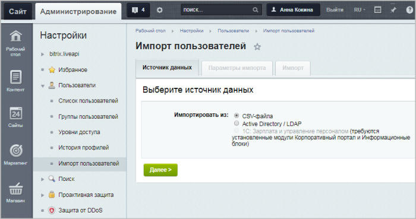

# Страница импорта

**Навигация**
- [← Оглавление курса](index.md)
- [← Предыдущий: 5336 — Типовые роли пользователей сайта](lesson_5336.md)
- [Следующий: 2009 — Импорт пользователей из CSV-файла →](lesson_2009.md)

Официальная страница урока: https://dev.1c-bitrix.ru/learning/course/index.php?COURSE_ID=48&LESSON_ID=7198

### Как добавить целый список пользователей

Для добавления целого списка пользователей в систему служит специальная страница административного раздела **Импорт пользователей**.

Перейдите на страницу **Импорт пользователей** (Настройки &gt; Пользователи &gt; Импорт пользователей). Откроется форма импорта:

Выберите нужный источник данных и нажмите кнопку **Далее**.

**Обратите внимание!** Во время загрузки можно сохранить старую привязку пользователей к их группам либо указать, чтобы все пользователи привязались к какой-нибудь указанной группе портала. Выборочное изменение привязки пользователей из одного списка по разным группам невозможно.

В следующих уроках читайте подробнее, как импортировать пользователей [из CSV-файла](lesson_2009.md) и [из LDAP-directory](lesson_2013.md).

### Документация по теме

- [Импорт пользователей](https://dev.1c-bitrix.ru/user_help/settings/users/user_import.php)
