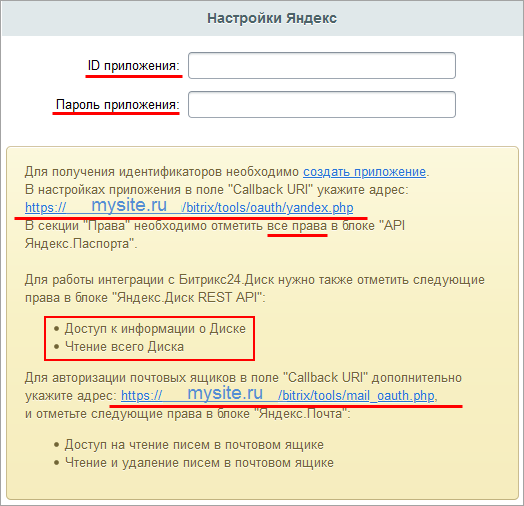
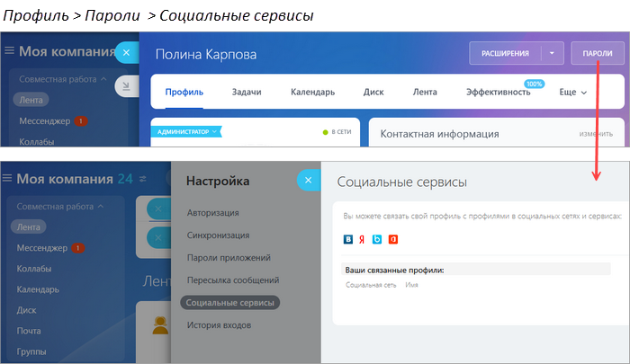

# Яндекс

**Навигация**
- [← Оглавление курса](index.md)
- [← Предыдущий: 11133 — Общие примечания](lesson_11133.md)
- [Следующий: 7285 — Одноклассники →](lesson_7285.md)

Официальная страница урока: https://dev.1c-bitrix.ru/learning/course/index.php?COURSE_ID=48&LESSON_ID=7289

|  | ### Яндекс |
| --- | --- |

- [Получение ID приложения и Пароля приложения](#oauth_yandex)
- [Настройка авторизации](#auth)
- [Настройка работы Битрикс24.Диск и Яндекс.Диск](#yandex_disk)

#### Получение ID приложения и Пароля приложения

Для Яндекса необходимо указать в

			настройках

                    

		 модуля **Социальные сервисы** (Настройки &gt; Настройки продукта &gt; Настройки модулей &gt; Социальные сервисы) параметры **ID приложения** и **Пароль приложения**, а в настройках сервиса специальную ссылку.

Получить уникальные **ID приложения** и **Пароль приложения** нужно на сайте [Яндекс OAuth](https://oauth.yandex.ru/).

Для этого необходимо:

1. **Зарегистрировать новое приложение** по одноименной [ссылке](https://oauth.yandex.ru/client/new) в настройках модуля **Социальные сервисы** продукта «1С-Битрикс» (Настройки &gt; Настройки продукта &gt; Настройки модулей &gt; Социальные сервисы). При регистрации приложения обязательно указать **Название приложения**:
  
2. Ввести в
  			поля
                      Поля **Callback URI** становятся доступны только при выборе опции Веб-сервисы. Второе поле появляется после нажатия кнопки **Добавить**.
  		 **Callback URI #1** и **Callback URI #2**
  			адреса
                      
  		 из настроек модуля **Социальные сервисы** (в примере - www.mysite.ru - ваш адрес сайта).
3. В разделе **Доступы** выставить
  			права
  **-** Доступ к адресу электронной почты
  **-** Доступ к дате рождения
  **-** Доступ к логину, имени и фамилии, полу
  **-** Доступ к портрету пользователя
  		 для **API Яндекс ID**. Для авторизации почтовых ящиков в блоке **Яндекс.Почта** также отметить нужные
  			права
                      
  		.
  Чтобы работала исходящая почта, отметьте право Отправка писем через Яндекс.Почту по протоколу SMTP. Затем настройте локальный SMTP-сервер по инструкции [Локальные настройки SMTP-сервера](https://dev.1c-bitrix.ru/learning/course/index.php?COURSE_ID=43&LESSON_ID=23612).
  Нажмите кнопку **Сохранить**
4. Далее откроется страница, где будут указаны
  			ID приложения и Пароль приложения
                      
  		, которые нужно вписать в соответствующие поля в настройках модуля **Социальные сервисы** продукта «1С-Битрикс» (Настройки &gt; Настройки продукта &gt; Настройки модулей &gt; Социальные сервисы) :

#### Настройка авторизации

Чтобы привязать данные учетной записи Яндекс к аккаунту в *1С-Битрикс24* или *1С-Битрикс: Управление сайтом*, выполните следующие действия:

- перейдите на страницу своего профиля,
- кликните на значок Яндекс и введите данные для авторизации в этой сети.

#### Настройка работы Битрикс24.Диск и Яндекс.Диск

Для работы **Битрикс24.Диск** с **Яндекс.Диск** нужно в разделе **Доступы** выставить права для

			Яндекс.Диск REST API

                    

		:

**Примечание:**Со временем социальные сервисы могут изменять внешний вид мастеров регистрации приложений. В уроках могут не отображаться последние изменения. Пожалуйста, сообщайте нам о замеченных вами изменениях.

	 Для отправки комментария воспользуйтесь расположенной в правом нижнем углу окна браузера кнопкой:
