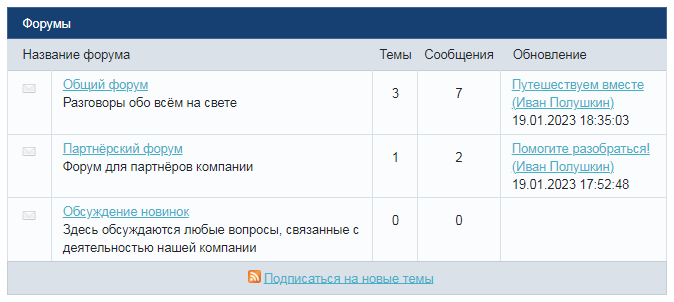
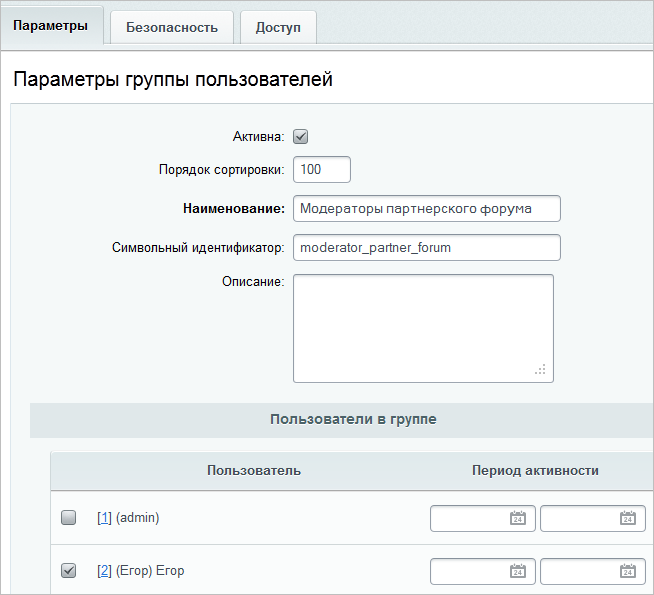
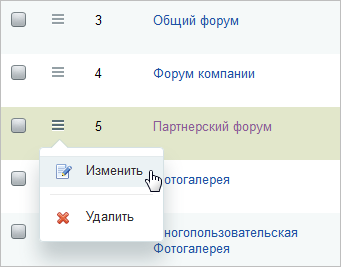

# Назначение модератора форума

**Навигация**
- [← Оглавление курса](index.md)
- [← Предыдущий: 2968 — Фильтр нецензурных слов](lesson_2968.md)
- [Следующий: 4755 — Экстранет →](lesson_4755.md)

Официальная страница урока: https://dev.1c-bitrix.ru/learning/course/index.php?COURSE_ID=48&LESSON_ID=7360

Модерирование форума – одна из задач, которую поручают контент-менеджеру. Чтобы он мог выполнять эту задачу нужно дать ему расширенные, по отношению к обычному посетителю сайта права. Пользователь с правами модератора форума может скрывать\показывать сообщения и темы, переносить их в другие форумы, закрывать\прикреплять темы.

### Постановка задачи

Возьмем ситуацию, когда у нас есть три форума:

На партнерском форуме модератором нужно сделать пользователя **Егор**, на форуме компании - пользователя **Иван**. А общий форум они должны модерировать оба вместе.

### Создание групп пользователей

Создадим группы пользователей, члены которых будут иметь права модератора на работу с соответствующими форумами. Для этого перейдите на страницу административного раздела Настройки &gt; Пользователи &gt; Группы пользователей и нажмите **Добавить группу** на контекстной панели. Откроется форма создания новой группы:

Заполните поля на вкладке **Параметры**. На вкладке **Пользователи в группе** отметим галочкой пользователя **Егор** и сохраним внесенные изменения.

Аналогично создадим группу **Модераторы форума компании** и включим в нее пользователя **Иван**.

Для обеих групп в настройках вкладки **Доступ** для модуля Форум укажите право **Запись**. Для остальных модулей оставьте право **По умолчанию**.

### Установка прав доступа

Перейдите на страницу Сервис &gt; Форумы &gt; Список форумов и кликните левой кнопкой мыши пункт

			Изменить

                    

		 в меню действий партнерского форума:

На вкладке **Доступ** для созданной нами группы пользователей **Модераторы партнерского форума** зададим право доступа **модерирование**:

Аналогичным образом задайте такое же право доступа на **Форум компании** для группы **Модераторы форума компании**.

Для общего форума следует выставить право на модерацию для обеих групп:

Всё, настройка произведена, модераторы могут приступать к работе.

### Дополнительно

- Также о работе с форумами в публичной части читайте в курсе [Контент-менеджер](https://dev.1c-bitrix.ru/learning/course/index.php?COURSE_ID=34&CHAPTER_ID=02455&LESSON_PATH=3905.4753.2455).
