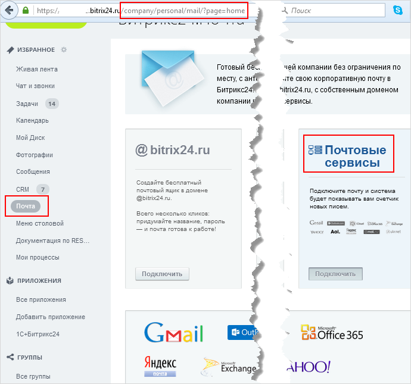
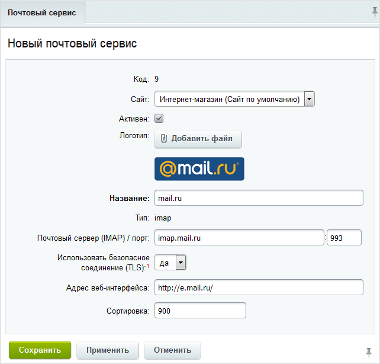

# Почтовые сервисы

**Навигация**
- [← Оглавление курса](index.md)
- [← Предыдущий: 2865 — Журнал работы](lesson_2865.md)
- [Следующий: 2945 — Настройка почты на Linux →](lesson_2945.md)

Официальная страница урока: https://dev.1c-bitrix.ru/learning/course/index.php?COURSE_ID=48&LESSON_ID=7475

Управление списком сервисов электронной почты, доступных на странице портала

			`/company/personal/mail/?page=home`

                     

		 в блоке "Почтовые сервисы", осуществляется на административной странице Сервисы &gt; Почта &gt; Почтовые сервисы. Пользователи могут подключать почтовые ящики только в сервисах из этого списка. Администратор портала может настраивать этот список, и, тем самым, запрещать или разрешать пользоваться почтой на портале в определенных сервисах.

<!-- &lt;p&gt;
	&lt;img src="/user_help/poch_serv.png"&gt;
&lt;/p&gt; -->

**Примечание:** количество доступных почтовых сервисов не ограничено.

Для добавления нового сервиса служит кнопка **Добавить**, расположенная на контекстной панели. Переход к редактированию существующего сервиса осуществляется с помощью меню действий (пункт **Изменить**) либо с помощью двойного клика по соответствующей записи.

 

Работа с параметрами открывающейся формы добавления/изменения аналогична работе в других формах модуля **Почта**.

## Если при добавлении нового сервиса выбран тип почтового сервера domain

В этом случае в форме добавления появляются два новых поля: **Доменное имя** и **Токен**

В эти поля вносятся данные, полученные у доменного регистратора. Уточняйте процедуру их получения у вашего регистратора. Например, о получении

			ПДД

                    Яндекс.Почта для домена

		-токена Яндекс можно почитать [здесь](https://yandex.ru/dev/pdd/doc/concepts/access.html).

|  |
| --- |

|  | #### Документация по теме: |
| --- | --- |

- [Почтовые сервисы](https://dev.1c-bitrix.ru/user_help/service/mail/mail_services.php)
- [Создание и редактирование почтового сервиса](https://dev.1c-bitrix.ru/user_help/service/mail/mail_service_edit.php)
