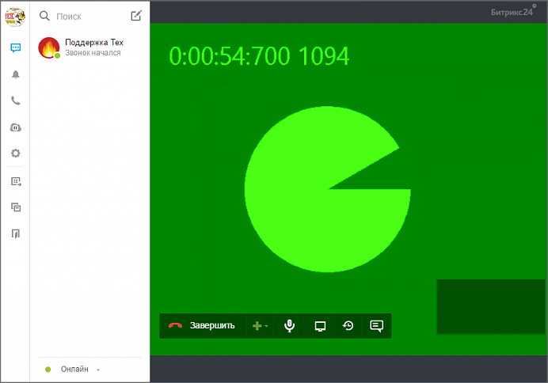

# Решение проблем с телефонией и видеозвонками

**Навигация**
- [← Оглавление курса](index.md)
- [← Предыдущий: 5017 — Настройки локальной сети](lesson_5017.md)
- [Следующий: 2617 — Организация работы службы поддержки →](lesson_2617.md)

Официальная страница урока: https://dev.1c-bitrix.ru/learning/course/index.php?COURSE_ID=48&LESSON_ID=7967

### Описание, логи


При решении проблем с видео и аудио связью нужно понимать что связь - многофакторная система, проблема может быть на самом разном уровне. Виноваты могут быть и оператор связи (Voximplant), и сети (локальные и Web), и конечное оборудование клиента и так далее. Оптимальный способ поиска проблемы - поочерёдная проверка всех составляющих этого процесса.


**Примечание**: Компания 1c-Битрикс не является оператором связи и не отвечает за качество работы IP-телефонии.


#### Логи Битрикс24


Одним из инструментов анализа связи могут быть логи, которые ведёт *Битрикс24*. Логи можно просмотреть в колонке

			Журнал

                    При возникновении каких-либо вопросов по работе телефонии Битрикс24 техническому специалисту Поддержки24 может понадобиться логи звонка. В логе содержится достаточно технической информации, чтобы выявить ошибки соединения.

Подробнее на [helpdesk.bitrix24.ru](https://helpdesk.bitrix24.ru/open/6017375/).

		 на странице Телефония &gt; Детализация звонков.


**Примечание**: При использовании *Битрикс24 в коробке* необходимо для ведения логов в настройках NGINX установить параметр `proxy_ignore_client_abort on;`.


Далее в уроке приведены несколько методов проверки элементов связи и описание процессов, происходящих при звонках. Надеемся, что это поможет при решении проблем.


### Локальная сеть и мессенджеры


#### Проверка настроек локальной сети


В любом случае нужно начать поиск проблем с проверки

			настроек локальной сети

                    Использование телефонии требует правильной настройки локальной сети, откуда совершаются звонки.

[Подробнее](lesson_5017.md)...

		, файерволлов и антивирусов. Важно помнить, что в случае телефонии нужно отслеживать актуальность IP-адресов по требованиям от Voximplant'а. Эти требования периодически меняются, компания Битрикс отслеживает эти изменения. Таблица адресов и портов, которые должны быть открыты на главной странице раздела **Телефония** всегда актуальна.


#### Настройки мессенджера


Кроме технических проблем с оборудованием возможна некорректная настройка мессенджера. В этом случае:


- Нужно зайти в настройки мессенжера, вкладка Звонки.
- Явно выбрать нужное оборудование (камеру, микрофон и динамики) и сохранить изменения.


### Проверка качества связи


**Как проверить качество связи между двумя конкретными пирами в реальной сетевой обстановке**


Иногда при выяснении причин плохой связи при видеозвонках подозрение падает на особенности клиентского оборудования - гарнитуру, камеру, особенности драйверов и тому подобного. Например, клиент жалуется: *"со временем звук начинает хрипеть, а затем и вовсе пропадает, хотя видео идёт"*. Одна из возможных причин: проблемы гарнитуры пользователя. Вот в этом случае можно запустить у того же клиента Десктопное приложение в тестовом режиме с тестовым медиа (исключающим влияние некорректно работающей гарнитуры) и запустить ещё один сеанс связи с тем же собеседником. Если в этом режиме связь не пропадает, то подозрение укрепляется. Если пропадает все равно, то дело скорее всего в NAT/Firewall, некорректной работе WebRTC, TURN и так далее, и гарнитуру менять бесполезно.


Один из способов протестировать связь описан в статье: [Как быстро проверить качество связи?](https://helpdesk.bitrix24.ru/open/4554161/)


Другой способ протестировать связь теми же участниками, но с "виртуальными" медиаустройствами, исключающими влияние реального медиа-оборудования, и таким образом подтвердить или опровергнуть подозрения.


Для этого запустите **Bitrix24.exe** (десктопное приложение) с ключом `--use-fake-device-for-media-stream`:


```
Bitrix24.exe --use-fake-device-for-media-stream
```


При запуске с ключом встроенный Chrome будет сам генерировать тестовое видео и аудио. Видео покажет динамически закрашиваемый круг и счетчики, а аудио будет передавать периодический тоновый сигнал.





Либо можно организовать трансляцию аудио и видео из файлов для тестирования с более сложным медиа-потоком:


```
Bitrix24.exe --use-fake-device-for-media-stream --use-file-for-fake-video-capture="waterfall_cif.y4m" --use-file-for-fake-audio-capture="a2002011001-e02.wav"
```


К тестовым файлам есть особые требования: видео в формате **y4m**, аудио в формате **wav** с дискретизацией 44.1 КГц. Видеофайлы должны быть заготовлены заранее, размещены локально в папке с десктопным приложением Битрикс24. Названия файлов, если они отличается от того, что в примере, должны быть указаны в ключе.


Если тестовые файлы отображаются и озвучиваются хорошо, то это говорит о проблемах с оборудованием.


### Перевод звонка через sip-аппарат


Если есть проблемы при переводе звонка через sip-аппарат, то в решении этих проблем может помочь знание того, как происходит переадресация звонка через аппарат.


В переадресации участвуют три стороны:


1. Тот, кто переводит (**Transferor**)
2. Кого переводит (**Transferee**)
3. На кого переводят (**Transfer target**)


В момент совершения переаресации sip-аппарат обменивается рядом sip-сообщений с оператором связи Voximplant. По результатам этого обмена Voximplant:


- объединяет медиа-потоки Transferree и Transfer target
- разъединяет медиа-потоки Transferree и Transferor
- во все три плеча отправляет событие `CallEvents.TransferComplete` с указание роли этого плеча в переводе.


Если в журнале звонка данное событие отсутствует (и клиент нажимает правильные кнопки для перевода), то:


- либо у клиента аппарат формирует нестандартные сип-команды,
- либо у клиента какие-то сетевые проблемы.


В этом случае, лог такого звонка надо отправлять в техподдержку *Битрикс24*, разобраться что именно приходило от аппарата клиента, может только оператор связи Voximplant.
