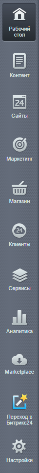

# Административное меню

**Навигация**
- [← Оглавление курса](index.md)
- [← Предыдущий: 1984 — Административная панель управления](lesson_1984.md)
- [Следующий: 2735 — Меню функций →](lesson_2735.md)

Официальная страница урока: https://dev.1c-bitrix.ru/learning/course/index.php?COURSE_ID=48&LESSON_ID=7977

|  | ### Первый уровень иерархии: выбираем логический блок функционала |
| --- | --- |

Весь большой и разнообразный функционал 1С-Битрикс для удобства разбит в Административном меню на логические блоки. В зависимости от того, установлены ли те или иные модули, состав административного меню может различаться: какие-то блоки могут отсутствовать. Например, в редакциях **Старт**, **Стандарт** будет отсутствовать блок **Интернет-магазин**.

|  | **Рабочий стол** - [инструмент](https://dev.1c-bitrix.ru/learning/course/index.php?COURSE_ID=34&CHAPTER_ID=03068&LESSON_PATH=3905.4455.4459.3068) для организации удобного управления работой сайта с помощью произвольно размещаемых гаджетов. |
| --- | --- |
