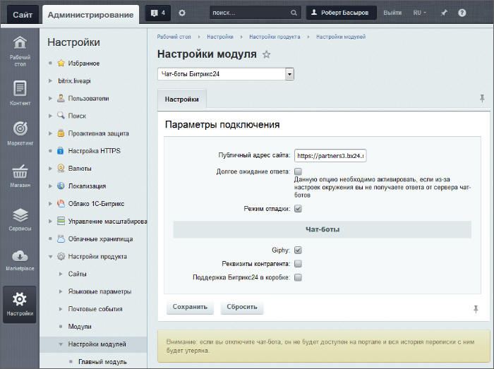

# Настройки

**Навигация**
- [← Оглавление курса](index.md)
- [← Предыдущий: 5048 — Установка модуля](lesson_5048.md)
- [Следующий: 2710 — Установка модуля и настройка сайта экстранета →](lesson_2710.md)

Официальная страница урока: https://dev.1c-bitrix.ru/learning/course/index.php?COURSE_ID=48&LESSON_ID=8399

### Настройка модуля

Настройка производится на странице  Настройки &gt; Настройки продукта &gt;Настройки модулей &gt; Чат-боты Битрикс24:

- **Публичный адрес сайта** - также должен быть правильно определен адрес портала. Он должен быть указан вместе с адресом портала и протоколом. Закрывающий слэш не обязателен.
- **Режим отладки** - опция включает логгирование работы модуля в файле `/bitrix/modules/imbot.log`.
  **Примечание**: В файл пишется только лог ошибок, включать данную опцию имеет смысл только для отладки, лог трассировки сообщений в этот файл не пишется.
- **Долгое ожидание ответа** - опция появляется после включения **Режима отладки**. Включение влияет на количество занятых worker-ов хостинга. Без активации этой опции сообщение чат-боту отправляется и worker освобождается. В случае активации опции worker будет занят до момента ответа чат-ботом (а это может занимать десятки секунд). Поэтому включать эту опцию нужно, только если не получилось корректно настроить окружение, и оно блокирует входящие запросы от marta.bitrix24.tech.
- **Чат боты** - опции включения чат-ботов. По умолчанию включён только чат-бот **Giphy** (показ картинок по запросу).

**Примечание**: Если возникают проблемы с прохождением сообщений, необходимо включить опцию **Долгое ожидания ответа** в опциях модуля.

### Настройка обращений к Техподдержке

Для облегчения общения администратора и разработчика с Техподдержкой "1С-Битрикс" рекомендуется использовать чат-бот **Поддержка Битрикс24 в коробке**. Включение этого бота имеет некоторые особенности, помимо установки флажка в списке чат-ботов.

1. Адрес, указанный в поле **Публичный адрес сайта** должен быть доступен из интернета.
2. Сертификат SSL должен быть валидным.
3. Лицензия на портал должна быть активна.

### Настройки локальной сети

Если ваш портал размещён за файерволлом или роутером, то в них должен быть открыт доступ к странице портала `/pub/imbot.php` с сервера marta.bitrix24.tech.

Внешним признаком недоступности портала из Интернета является то, что бот реагирует на ваш запрос (появляется текст ), но не выводит ответа.
