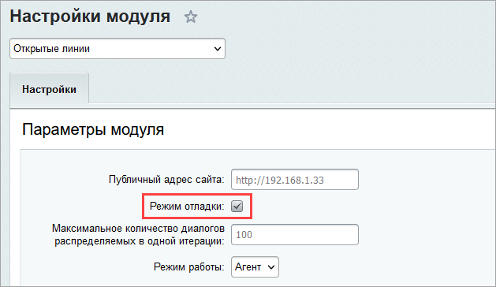
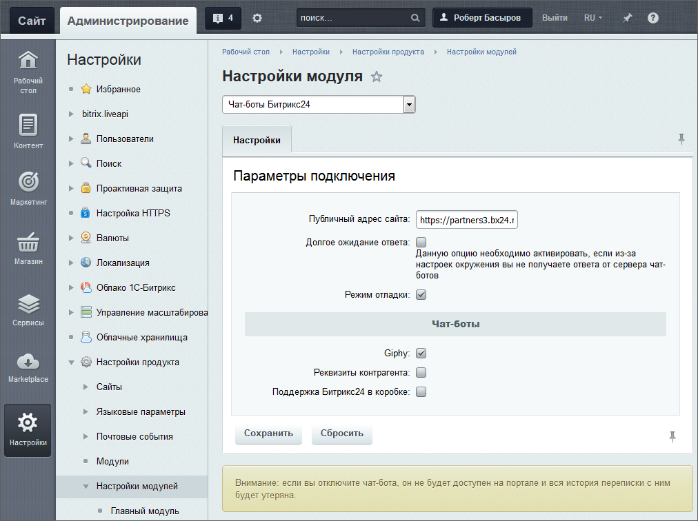

# Настройки сервера и модуля портала

**Навигация**
- [← Оглавление курса](index.md)
- [← Предыдущий: 20386 — Практические задания по темам Wiki, Веб-мессенджер, Календарь, Опросы](lesson_20386.md)
- [Следующий: 9219 — Запуск заданий Открытых линий из cron →](lesson_9219.md)

Официальная страница урока: https://dev.1c-bitrix.ru/learning/course/index.php?COURSE_ID=48&LESSON_ID=8405

Чтобы Открытые линии заработали, для *«Битрикс24 в коробке»* необходимо сделать дополнительные настройки сервера и модулей портала.

> **Открытые линии** - способ коммуникации с клиентами компании, посетителями сайта, с помощью которого собираются сообщения из разных каналов (мессенджеры, соцсети) в *Битрикс24*, распределяются по правилам очереди между сотрудниками и незаметно сохраняются в CRM.

**Внимание!** Данные настройки должен выполнять Администратор системы.

### Общие серверные настройки

1. Полный доступ из вне к http://адрес сайта/pub/imconnector/, к корню и всем файлам и поддиректориям.
2. **Действующий лицензионный ключ**.
3. Доступ со стороны портала ко всем внешним адресам, в частности к соцсети Вконтакте и другим по http и https.
4. Настройка параметра Nginx: `nginx proxy_ignore_client_abort on`. Эту настройку необходимо включать для конкретного `location`.
5. Если используется php-fpm, вместо `nginx proxy_ignore_client_abort on` используется параметр `fastcgi_ignore_client_abort on`.
6. Для работы коннектора **Онлайн-чат**:
  Для работы коннектора **Битрикс24.Нетворк**:
  - установленный и настроенный модуль **Чат-боты Битрикс24 (imbot)**;
  - доступ без авторизации к странице `/pub/imbot.php`;
  - если возникают проблемы с прохождением сообщений даже при таких настройках, необходимо включить опцию [Долгое ожидания ответа](#chatbot) в опциях модуля **Чат-боты Битрикс24**.

  - для `location /online/(/?)([^/]*)` разрешить `X-Frame-Options SAMEORIGIN` (открывать эту страницу как фрейм из любого сайта или только того, где будет расположен фрейм). Такие настройки могут быть в Nginx и в модуле **Проактивная защита** в разделе **Защита от фреймов** (Настройки  &gt; Проактивная защита  &gt; Защита от фреймов);

**Примечание.** В некоторых случаях может потребоваться отключить редиректы для файла коннектора вида `~/index.php` на `/`.

### Коннекторы для внешних мессенджеров

Настройка модуля **Коннекторы для внешних мессенджеров** (Настройки &gt; Настройки продукта &gt; Настройки модулей &gt; Коннекторы для внешних мессенджеров) проста:

<!-- спрятан из-за вайбера

&lt;p&gt;&lt;img src="/images/admin_expert/openlines/connector_set.png" /&gt;&lt;/p&gt; -->

- **Публичный адрес сайта** - нужно убедиться, что после установки был верно определен адрес портала. Он должен быть указан вместе с адресом портала и протоколом. Закрывающий слэш не обязателен.
- **Включить режим отладки** - эта опция включает лог ошибок работы коннекторов в файл `/bitrix/modules/imconnector_error.log`.
  **Примечание**: В файл пишется только лог ошибок, включать данную опцию имеет смысл только для отладки, лог трассировки сообщений в этот файл не пишется.
- **Разрешить поиск Открытых линий в Битрикс24.Network** - отмеченная опция разрешает поиск Открытых линий в **Битрикс24.Network**.
- **Список используемых коннекторов** - здесь выбираются коннекторы (каналы), доступные к [подключению](/learning/course/index.php?COURSE_ID=48&CHAPTER_ID=08327).

**Внимание!** Если не удается подключить каналы и происходит ошибка, то нужно в первую очередь в настройках модуля проверить верность указания доменного имени с протоколом и убедиться, что данный адрес доступен из интернета.

### Открытые линии

Для ведения лога ошибок самого модуля **Открытые линии** (Настройки &gt; Настройки продукта &gt;Настройки модулей &gt; Открытые линии) можно также включить **Режим отладки**:

Лог ошибок пишется в файл `/bitrix/modules/imopenlines.log`.

**Примечание.** В файл пишется только лог ошибок, включать данную опцию имеет смысл только для отладки, лог трассировки сообщений в этот файл не пишется.

**Внимание!** При работе Открытых линий для каждого внешнего клиента на портале создается пользователь типа экстранет. Обнаружив таких пользователей в

			списке пользователей

                    

		, не пугайтесь, вас не взломали. Это системные пользователи.

### Чат-боты Битрикс24

Настройки модуля **Чат-боты Битрикс24** (Настройки &gt; Настройки продукта &gt;Настройки модулей &gt; Чат-боты Битрикс24) также особой сложности не вызывают:

- **Публичный адрес сайта** - также должен быть правильно определен адрес портала. Он должен быть указан вместе с адресом портала и протоколом. Закрывающий слэш не обязателен.
- **Режим отладки** - опция включает логгирование работы модуля в файле `/bitrix/modules/imbot.log`.
  **Примечание**: В файл пишется только лог ошибок, включать данную опцию имеет смысл только для отладки, лог трассировки сообщений в этот файл не пишется.
- **Долгое ожидание ответа** - опция появляется после включения **Режима отладки**. Включение влияет на количество занятых worker-ов хостинга. Без активации этой опции сообщение чат-боту отправляется и worker освобождается. В случае активации опции worker будет занят до момента ответа чат-ботом (а это может занимать десятки секунд). Поэтому включать эту опцию нужно, только если не получилось корректно настроить окружение, и оно блокирует входящие запросы от marta.bitrix24.tech.
- **Чат боты** - опции включения чат-ботов. По умолчанию есть возможность включить чат-боты **Giphy**, **Реквизиты контрагента** и **Поддержка Битрикс24 в коробке**.
  **Примечание**: Подробнее про чат-бот **Поддержка Битрикс24 в коробке** можно прочитать [в одноименной статье](https://helpdesk.bitrix24.ru/open/7577357/).
