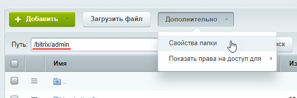

# Принципы управления доступом

**Навигация**
- [← Оглавление курса](index.md)
- [← Предыдущий: 12802 — Практические задания](lesson_12802.md)
- [Следующий: 10491 — Уровни доступа для стандартных групп пользователей →](lesson_10491.md)

Официальная страница урока: https://dev.1c-bitrix.ru/learning/course/index.php?COURSE_ID=48&LESSON_ID=8573

|  | ### Главные принципы управления доступом |
| --- | --- |

Управление доступом в рамках системы подразумевает:

- [доступ к модулям](lesson_2016.md),
- [доступ к элементам динамического контента](lesson_2017.md),
- [доступ к файлам и папкам](lesson_2019.md).

Доступ для конкретного пользователя осуществляется в рамках **Группы пользователей**.

То есть, чтобы пользователь получил определённые права, необходимо включить его в группу с нужным уровнем прав. Если пользователь включен в несколько групп, ему будет присвоен максимальный уровень прав из всех этих групп. Это означает, что пользователь сможет выполнять действия и получать доступ к ресурсам системы на основе наивысших прав, предоставленных любой из его групп.

## Назначение прав доступа для отдела с подотделами в Битрикс24

В Битрикс24 можно назначать права доступа отделу вместе со всеми его подотделами.

Используйте эту возможность, если хотите дать одинаковые права всем отделам и подотделам без исключений. Назначить подотделу права ниже, чем у отдела с подотделами, не получится из-за правила максимальных прав. В таком случае настройте права для каждого отдела и подотдела раздельно.

В [таблице](https://dev.1c-bitrix.ru/learning/course/index.php?COURSE_ID=35&LESSON_ID=6767) приведены права доступа по умолчанию к модулям системы для стандартных групп пользователей.

**Внимание!** При включении пользователя в новую группу или при расширении прав группы для получения всего возможного уровня прав пользователю необходимо **заново авторизоваться** в системе.

Все пользователи, которым требуется вносить хоть какие-то изменения в Публичной части сайта, должны иметь

			доступ

                    Перейдите в раздел **Файлы и папки** (Контент &gt; Структура сайта &gt; Файлы и папки) и

откройте папку `/bitrix/admin`.

Для настройки прав доступа к текущей директории (папке) нужно воспользоваться

кнопкой **Свойства папки**, расположенной на контекстной панели:

[Подробнее](lesson_2019.md)...

		 на чтение к папке `/bitrix/admin`.

Единую концепцию управления правами, подходящую для всех или большинства случаев, предложить крайне сложно: слишком велико разнообразие потребностей пользователей. Ниже перечислены **общие моменты** управления правами в большом проекте с большим числом пользователей:

- В Wiki, в стороннем файле, на недоступной для обычных пользователей странице должны быть описаны регламенты доступа для групп и пользователей, подключённых через функционал расширенных прав.
- Когда в рамках проекта принимается решение о том, что теперь конкретный пользователь или пользователи группы "такой-то" имеют право добавлять/изменять/удалять новости "такого-то" раздела, то эта информация добавляется в регламент. Важно: указывается срок жизни этого правила.
- После обновления регламентов "вручную" или через бизнес-процессы ставится задача ИТ службе. Служба исполняет это решение централизовано (
  			AD/LDAP
  Модуль **AD/LDAP интеграция** позволяет исключить повторные операции и сократить затраты времени и труда на управление группами пользователей корпоративной информационной системы. С его помощью можно **установить соответствие** между группами пользователей корпоративной сети и группами пользователей *Bitrix Framework*, что позволяет организовать централизованное управление всеми группами пользователей корпоративной информационной системы.
  [Подробнее](https://dev.1c-bitrix.ru/learning/course/index.php?COURSE_ID=48&CHAPTER_ID=04536&LESSON_PATH=3906.4503.4536)...
  		) или в конкретном проекте.
