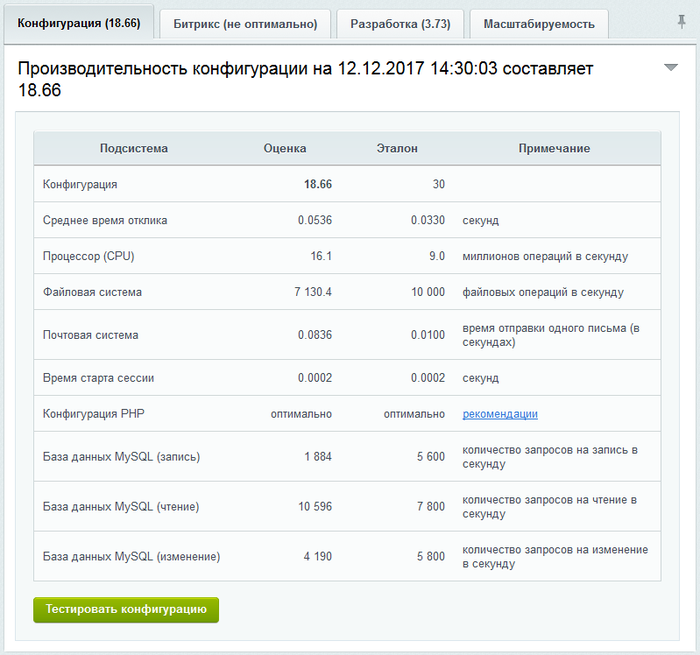

# Вкладка Конфигурация

**Навигация**
- [← Оглавление курса](index.md)
- [← Предыдущий: 7167 — Панель производительности: поиск "узких" мест сайта](lesson_7167.md)
- [Следующий: 8601 — Вкладка Битрикс →](lesson_8601.md)

Официальная страница урока: https://dev.1c-bitrix.ru/learning/course/index.php?COURSE_ID=48&LESSON_ID=8591

### Вкладка Конфигурация

Во вкладке отображаются текущие показатели производительности подсистем сервера и сравнение их с показателями эталонной системы.

Если какая-то подсистема не удовлетворяет оптимальным условиям, то будет выведена ссылка с рекомендациями по исправлению в колонке **Примечание**.

### Основные ошибки конфигурации

- **Не установлен акселератор php**.
  Наличие акселератора php просто жизненно необходимо, даже без дополнительных настроек страницы открываются в три раза быстрее, во столько же раз снижается нагрузка на процессор. Поддерживается акселератор *OPcache*.

- **Включено ограничение open_basedir.**
  На shared хостинге сложно отделить клиентов друг от друга. Самый простой вариант: включить *open_basedir*, тогда на все операции с файлами происходит дополнительная проверка пути. Это существенно снижает производительность. Решением будет использовать собственный экземпляр Apache для каждого пользователя или установка дополнительных модулей на сервер для ограничения доступа. В этом случае  ограничение open_basedir ставить не нужно! Доступ ограничивается системой для пользователя веб-сервера.
- **Не установлен или не настроен NGINX.**
  Хоть это напрямую не влияет на оценку производительности, но чрезвычайно важно для нагруженных проектов: лучше когда статика (картинки, стили, ява скрипты) отдаётся NGINX'ом и не обрабатываться Apache. Посмотрите логи доступа Apache: там не должно быть ни одного запроса к статике!
- **Не настроена база данных.**
  По возможности всегда используйте формат данных **InnoDB**, рекомендуемые настройки смотрите на странице монитора производительности [Сервер БД](lesson_5132.md).
- **Стоят не оригинальные драйвера оборудования.**
  Особенно актуально для RAID контроллеров: при установке на *Linux* системах обычно предлагает к установке open source драйвера, которые не всегда достаточно эффективно работают с оборудованием. Всегда ставьте оригинальные драйвера с сайта разработчика.
- **PHP как CGI.**
  PHP, запускаемый как *CGI* (не **FastCGI**) – плохая схема.
  На каждое обращение к php-скрипту запускается новый процесс интерпретатора PHP. Все это работает очень медленно, производительность сайта будет крайне низкой.

### Как читать оценку подсистем

Монитор производительности не имеет прямого доступа к системным ресурсам, поэтому оценки, полученные средствами PHP, в большей степени отражают работу PHP, чем сервера.

- **Конфигурация** - собственно, оценка производительности.
- **Среднее время отклика** - число, обратное оценке производительности.
- **Процессор (CPU)**. Делается большое число простых математических вычислений. Задача не распараллеливается, поэтому идет оценка работы одного ядра процессора. Когда сайт работает на VPS, здесь часто можно увидеть, что "зажат" процессор.
- **Файловая система**. Этот тест показывает не столько работу диска, сколько работу PHP с файлами: создается, исполняется, удаляется большое число простых файлов. Данный показатель зависит от производительности файловой системы и эффективности работы PHP акселератора. В целом хорошо показывает, как работает PHP на данной конфигурации (без учета работы базы).
- **Почтовая система**. Отправляется тестовое письмо на hosting_test@bitrix.ru. Содержимое письма: "This is test message. Delete it." Никакая служебная информация не передается! Если настроена отправка почты на cron, этот показатель можно игнорировать.
- **Время старта сессии**. Сессия стартует на каждый хит, поэтому это время будет прибавляться к работе каждой страницы. Проблемы обычно возникают, когда меняются настройки хранения сессий PHP так, что скапливаются сотни тысяч файлов сессий.
- **База данных (чтение/запись/удаление)**. Отправляется большое число простых запросов в базу. Это очень утрированный тест: он не показывает, как база будет работать со сложными запросами на больших объемах данных. Очевидно, что для базы данных на локальной машине цифры будут выше, чем для базы на отдельном сервере. Это нормально.
