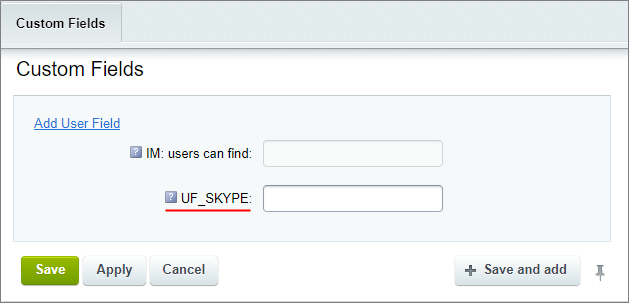
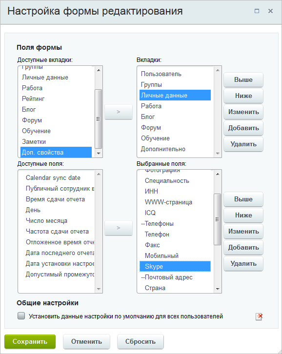

# Пример добавления поля

**Навигация**
- [← Оглавление курса](index.md)
- [← Предыдущий: 6309 — Создание Пользовательских полей](lesson_6309.md)
- [Следующий: 6471 — Работа с комментариями многопользовательской галереи →](lesson_6471.md)

Официальная страница урока: https://dev.1c-bitrix.ru/learning/course/index.php?COURSE_ID=48&LESSON_ID=8611

### Создание поля Скайп. Видеоурок

Опишем пример создания поля **Скайп** в форме добавления нового пользователя. Это поле будет относиться к сущности `USER` **Главного модуля**.

### Как добавить поле?

На закладке **Доп. поля** формы добавления нового пользователя (Настройки &gt; Пользователи &gt; Список пользователей &gt; Добавить пользователя) кликните по

			единственной имеющейся там ссылке

                    

		.

**Примечание:** если вкладка **Доп. поля** отсутствует, то выполните

			настройку формы

 В правой части формы нажмите на «шестеренку»  . Откроется окно с настройками.

[Подробнее...](https://dev.1c-bitrix.ru/learning/course/index.php?COURSE_ID=34&LESSON_ID=1883)

		 .

По клику откроется форма добавления пользовательского свойства, сразу привязанного к нужной нам форме (поле **Объект** уже с заданным значением):

Заполните

			минимально необходимые поля

                    Об остальных полях формы добавления/редактирования пользовательского поля читайте в [пользовательской документации](/user_help/settings/settings/userfield_edit.php)

		:

- **Тип данных** - для ввода логина скайпа удобно значение **Строка**.
- **Код поля** - введите `UF_SKYPE` (код обязательно должен начинаться с `UF_`).
- Для возможности поиска по вашему пользовательскому полю отметьте галочкой **Значения поля участвуют в поиске**.
- В языковых настройках укажите как будет называться ваше поле: для русского языка - **Скайп**, для английского - **Skype**.

**Примечание**: если название для языка не заполнено, то вместо названия отобразится **Код поля**. Например, если в нашем примере

			не указать

                    

		 название для английского языка, то в форме создания / редактирования пользователя для русского языка отобразится

			Скайп

                    

		, а для английского

			UF_SKYPE

                    

		.

Сохраните внесенные изменения.

Затем снова перейдите к форме добавления нового пользователя и нажмите кнопку

			**Настроить**

                    

		  на контекстной панели. Появится окно настройки формы редактирования/добавления нового пользователя.

Настройте форму,

			перенеся созданное свойство

                    Облегчите свой труд, используйте инструмент настройки форм инфоблоков. Инструмент учитывает индивидуальные потребности, позволяет настроить формы редактирования разделов и элементов инфоблока под себя...

[Подробнее ...](https://dev.1c-bitrix.ru/learning/course/index.php?COURSE_ID=34&LESSON_ID=1883)

		 из вкладки **Доп. свойства** на вкладку **Личные данные**, т.к. именно на нее необходимо добавить поле **Скайп**. После того, как поле будет перенесено в список выбранных полей, с помощью кнопок **Выше** и **Ниже** выберите его расположение среди других полей секции

			**Телефоны**

                    

		 .

Пометьте галочкой опцию **Установить данные настройки по умолчанию для всех пользователей** и нажмите **Сохранить**.

Теперь новое поле будет доступно для заполнения при добавлении новых пользователей и в формах настройки текущих:

Название нового поля выведено в виде гиперссылки, нажав на которую вы перейдете в форму редактирования данного поля.

### Документация по теме

- [Создание и редактирование пользовательского поля](https://dev.1c-bitrix.ru/user_help/settings/settings/userfield_edit.php)
