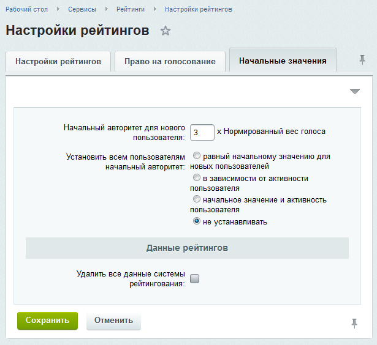
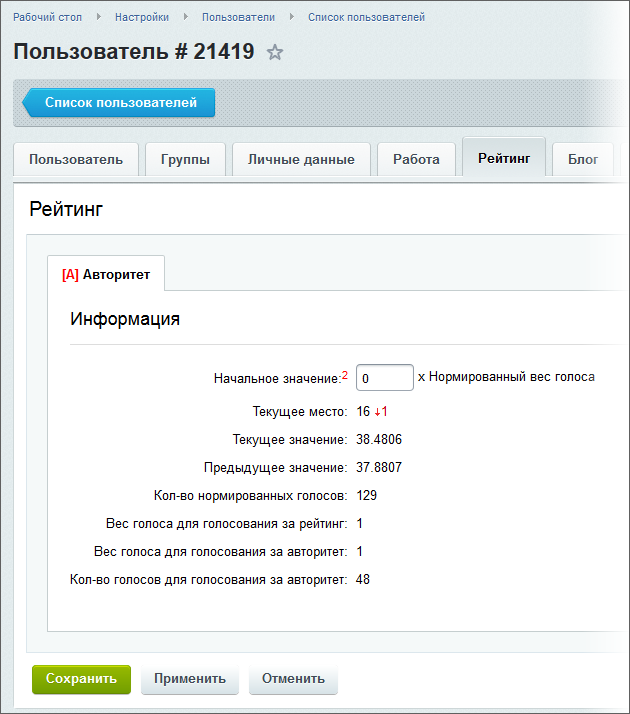
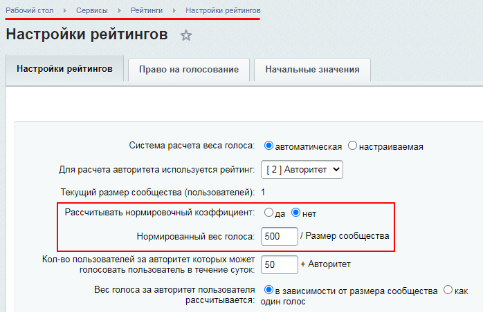
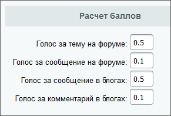

# Что такое рейтинги

**Навигация**
- [← Оглавление курса](index.md)
- [← Предыдущий: 3577 — Настройка вида страницы ошибки 404](lesson_3577.md)
- [Следующий: 1987 — Расчёт и особенности рейтингов →](lesson_1987.md)

Официальная страница урока: https://dev.1c-bitrix.ru/learning/course/index.php?COURSE_ID=48&LESSON_ID=8621

### Кто авторитетнее на сайте

В общем случае система устроена так, что все основные расчеты происходят автоматически по внутренним механизмам. По умолчанию также активен всего лишь один главный рейтинг в системе - **Авторитет**.

> **Авторитет** – численный показатель признания пользователя сообществом, влияет на значимость голоса человека, когда он голосует за контент. Авторитет также служит основным механизмом регулирования сообщества через доступность тех или иных функций (в зависимости от авторитета можно настроить право публикации сообщений, комментировать, и так далее).

> **Рейтинг** – численный показатель, отражающий полезную активность человека, ценность контента для сообщества.

### Cхема работы системы рейтингов по умолчанию

Каждый новый пользователь имеет уже заранее указанный в настройках

			начальный авторитет

                    Настройки рейтингов (Сервисы &gt; Рейтинги &gt; Настройки рейтингов вкладка **Начальные значения**)

		, который можно при желании

			изменить

                    После изменения данного параметра потребуется пересчитать рейтинг вручную:

		.

Таким образом, он сразу после регистрации может участвовать в активной жизни сообщества. По умолчанию, пользователь будет получать 3

			нормированных голоса

Нормированный голос - это 1000 / Размер сообщества. Размер сообщества - это пользователи, которые имеют право голосовать и заходящие на сайт не позднее 90 дней (количество дней и "1000" можно задать на странице Сервисы &gt; Рейтинги &gt; Настройки рейтингов вкладка **Начальные значения**).

		, при стандартных настройках, что позволит ему сразу голосовать за рейтинг контента и соответственно авторитет пользователя.

**Примечание:** Для отдельных пользователей можно вручную указать иное, чем по умолчанию, начальное значение авторитета на закладке

			Рейтинг

                    

		 страницы настроек пользователя (Настройки &gt; Пользователи &gt; Список пользователей). Там же отображаются текущие значения параметров, связанные с рейтингом пользователя.

> **Нормированный вес голоса** - это минимальный вес одного голоса в системе. Нормированный вес голоса  зависит от размеров сообщества и рассчитывается по следующей формуле:
>
>
>
> **Нормированный вес голоса = коэффициент / размер сообщества**
>
>
>
> Коэффициент по умолчанию равен 1000, но его можно задать вручную на странице
>
> 			Настройки рейтингов
>
>
>
>
> Чтобы вручную задать коэффициент нормированного веса голоса, нужно установить режим
>
> ручного расчёта, отметив в пункте **Рассчитывать нормировочный коэффициент** вариант **нет**:
>
>
> 
>
>
>
>
> 		.
>
>
>
> Значение авторитета напрямую зависит от нормированного веса голоса.

Общее количество голосов пользователя рассчитывается по формуле: Авторитет / вес одного нормированного голоса.

Нормировка от размера сообщества позволяет утверждать, что если в сообществе в 500 человек у вас авторитет равен 100, и в сообществе на 500 000 человек у вас авторитет равен 100, это означает признание вас 10% сообщества.

> **Размер сообщества** – это число пользователей, которые заходили на сайт не позднее
>
> 			90 дней
>
>
>
>                     Настраивается на закладке **Право на голосование** страницы
> **Настройки рейтингов** (Сервисы &gt; Рейтинги &gt; Настройки рейтингов)
>
> 
>
>
>
> 		  с момента расчета рейтинга и имеют право голосовать.

При голосовании (нажатии **мне нравится**) пользователь отдает за контент автора количество голосов, равное результату деления авторитета пользователя на значение нормированного голоса.

Пользователи не могут напрямую голосовать за авторитет. Это возможно лишь косвенно, согласно правилу обработки голосов **Автоматическое голосование за авторитет пользователя** (Сервисы &gt; Рейтинги &gt; Правила обработки). По этому правилу на основе суммы голосов, оставленных за контент пользователя, происходит изменение  его авторитета.

Правило настроено так: один голос пользователя автоматически учитывается в авторитете автора контента, если в течение 90 дней за его контент проголосуют на 10 баллов в сумме. В секции

			Расчет баллов

                    

		 формы редактирования правила можно настроить, сколько баллов будет учитываться для разных типов голосования за контент автора.

**Примечание:** Для рейтинга (не авторитета) можно произвести настройки (Сервисы &gt; Рейтинги &gt; Список рейтингов секция **Критерии рейтингования**) так, что пользователи могут голосовать как за контент, так и напрямую за сам рейтинг.

Таким образом, по умолчанию, авторитет пользователя строится на основе правила автоматического голосования. Рейтинг же учитывает голоса за контент, его тип и.т.д.

### Документация по теме

- [Пользовательская документация по модулю "Рейтинги"](http://dev.1c-bitrix.ru/user_help/service/rating/index.php)
- [Саморегулируемое сообщество построенное на двухфакторном рейтинге (блог)](http://dev.1c-bitrix.ru/community/blogs/rsv-dev/2386.php)
- [Рейтинги: создание собственного критерия рейтингования (блог)](http://dev.1c-bitrix.ru/community/blogs/hazz/2303.php)
