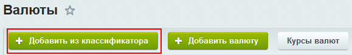
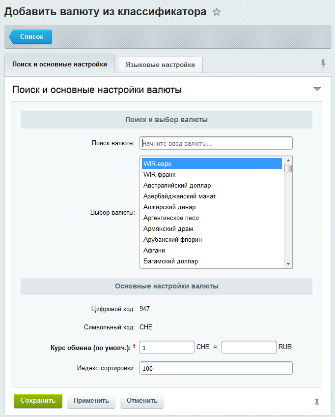

# Создание валют через классификатор

**Навигация**
- [← Оглавление курса](index.md)
- [← Предыдущий: 6398 — Валюты: создание и управление](lesson_6398.md)
- [Следующий: 3164 — Курсы валют: создание курса →](lesson_3164.md)

Официальная страница урока: https://dev.1c-bitrix.ru/learning/course/index.php?COURSE_ID=48&LESSON_ID=8641

|  | ### Создание валют через классификатор |
| --- | --- |

Создать валюту можно через Классификатор валют. Это намного удобнее, чем ручное добавление, так как создание валюты сводится всего к нескольким кликам. При создании валюты надо указывать цифровой и алфавитный коды в соответствии с международным стандартом **ISO 4217**, а значит надо искать ссылку на этот стандарт, искать в стандарте данные по создаваемой денежной единице. Это долго. Классификатор валют сделает эту работу за вас.

Для создания денежной единицы воспользуйтесь кнопкой

			Добавить из классификатора

                    

		 на странице Списки валют, откроется форма создания:

В поле **Поиск валюты** начните набирать название нужной вам валюты и классификатор в окне ниже будет выводить названия.

После выбора нужной валюты классификатор сам подставит все нужные значения и в **Основных настройках валюты** и в **Языковых настройках**. Вам останется только узнать курс создаваемой валюты по отношению к базовой и ввести этот курс в поле **Курс обмена (по умолч.)**  и нажать на **Сохранить**.

Изменение основных или языковых настроек созданной таким образом валюты доступно после её сохранения и выполняется аналогично [простому добавлению валюты](lesson_6398.md).
