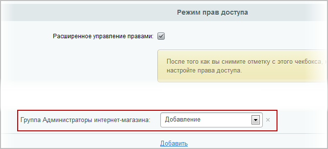

# Права на наполнение новостной ленты

**Навигация**
- [← Оглавление курса](index.md)
- [← Предыдущий: 5127 — Права на каталог товаров и услуг](lesson_5127.md)
- [Следующий: 5133 — Права на изменение статических страниц →](lesson_5133.md)

Официальная страница урока: https://dev.1c-bitrix.ru/learning/course/index.php?COURSE_ID=48&LESSON_ID=8657

Для настройки управления новостной лентой предстоит настроить **компонент** и **информационный блок**.

### Настройка компонента

В публичной части сайта перейдите в раздел **Новости**. Нажмите кнопку **Изменить страницу** и

			откройте в визуальном редакторе

                    

		 для редактирования параметры компонента **Новости**.

В открывшейся форме настроек комплексного компонента **Новости** перейдите к группе полей **Дополнительные настройки**:

Поставьте галочку в поле

			Использовать дополнительное ограничение доступа

                    Это поле есть только в компонентах: **Новости** (комплексный) и **Новость детально**.

		, после чего появится список **Группы пользователей, имеющие доступ к детальной информации**. Зажав клавишу Ctrl выделите в нем следующие группы:

- Администраторы
- Подписчики
- Администраторы интернет-магазина
- Контент-редакторы

Сохраните внесенные изменения.

### Настройка информационного блока

Перейдите в административную часть и перейдите к закладке **Доступ** формы настроек инфоблока новостей. С помощью

			расширенного режима

                    После установки флажка в поле Расширенное управление правами нажмите кнопку Применить, и форма перезагрузится...

[Подробнее ...](lesson_2017.md#advanced_mode)

		 управления правами инфоблока надо задать право доступа для администраторов интернет-магазина **Добавление**:

Нажмите **Сохранить** для применения внесенных изменений.
