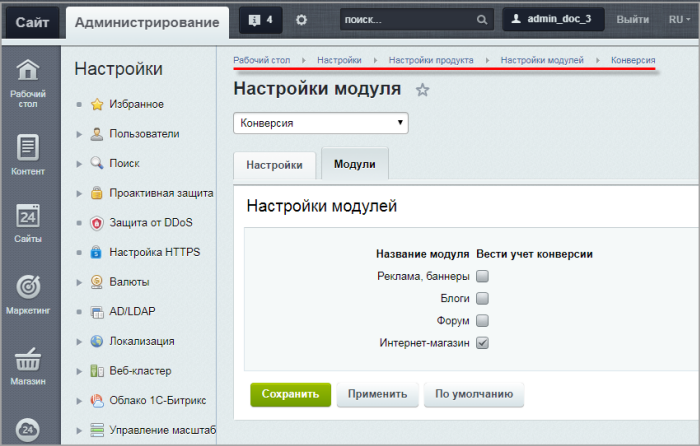

# Настройка модуля

**Навигация**
- [← Оглавление курса](index.md)
- [← Предыдущий: 9483 — Что влияет на конверсию](lesson_9483.md)
- [Следующий: 9039 — Создание собственных счетчиков и атрибутов →](lesson_9039.md)

Официальная страница урока: https://dev.1c-bitrix.ru/learning/course/index.php?COURSE_ID=48&LESSON_ID=9035

|  | ### Форма настроек |
| --- | --- |

Модуль **Конверсия** настраивается на странице Настройки &gt; Настройки продукта &gt; Настройки модулей &gt; Конверсия. Форма содержит следующие закладки:

- В закладке **Настройки** указывается базовая валюта для вывода экономических показателей сайта, например: Оплачено заказов, Оформлено заказов и т.п.
- В закладке **Модули** выбираются модули, для которых нужно рассчитывать конверсию.

**Внимание**! Данный модуль пока не является автоустанавливаемым, поэтому его требуется установить самостоятельно из страницы Настройки &gt; Настройки продукта &gt; Модули в административной части сайта.

**Примечание**: Подробнее о работе с **Конверсией** читайте в курсе [Продвижение сайта и Маркетинг](https://dev.1c-bitrix.ru/learning/course/index.php?COURSE_ID=139&CHAPTER_ID=09037&LESSON_PATH=11427.4544.9037).
