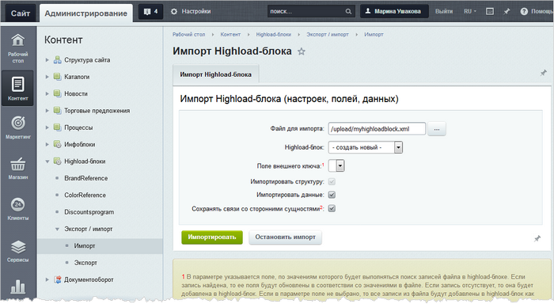
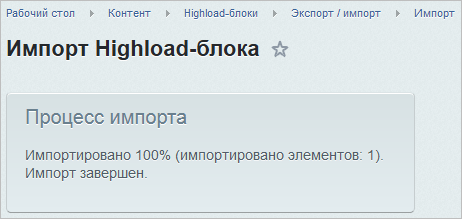
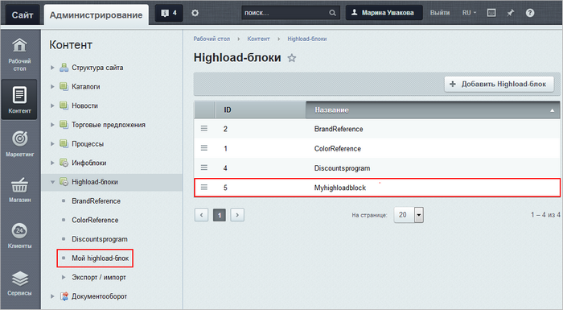

# Как загрузить целый Highload-блок

**Навигация**
- [← Оглавление курса](index.md)
- [← Предыдущий: 9139 — Как добавить данные в Highload-блок](lesson_9139.md)
- [Следующий: 20122 — Проверьте себя →](lesson_20122.md)

Официальная страница урока: https://dev.1c-bitrix.ru/learning/course/index.php?COURSE_ID=48&LESSON_ID=9071

|  | Вы хотите загрузить данные в новый Highload-блок? Сделайте это вместе с инструментом импорта. |
| --- | --- |


- **Шаг 1.**
  			Подготовьте XML-файл
                      Как подготовить XML-файл см. в предыдущем [уроке](lesson_9085.md)
  		 c данными и загрузите его на сервер.
  **Примечание**: если у вас в XML-файле есть описание поля типа **Файл**, то подготовьте и загрузите также файлы для записей Highload-блока в папку с названием ***&lt;имя_файла_импорта&gt;*_files**. Она располагается внутри той же папки, где и файл импорта.
   В качестве примера мы рассмотрим импорт на основе
  			простого файла
  ```
  <?xml version="1.0" encoding="UTF-8"?>
  <hiblock>
  	<hiblock>
  		<name>Myhighloadblock</name>
  		<table_name>b_my_highload_block</table_name>
  	</hiblock>
  	<langs>
  		<lang>
  			<lid>ru</lid>
  			<name>Мой highload-блок</name>
  		</lang>
  	</langs>
  	<fields>
  		<field>
  			<field_name>UF_NAME</field_name>
  			<user_type_id>string</user_type_id>
  			<sort>100</sort>
  			<multiple>N</multiple>
  			<mandatory>N</mandatory>
  			<show_filter>Y</show_filter>
  			<show_in_list>Y</show_in_list>
  			<edit_in_list>Y</edit_in_list>
  			<is_searchable>Y</is_searchable>
  			<settings>
  				<size>20</size>
  				<rows>1</rows>
  				<regexp />
  				<min_length>0</min_length>
  				<max_length>0</max_length>
  				<default_value />
  			</settings>
  			<edit_form_label>
  				<ru>Название торта</ru>
  			</edit_form_label>
  			<list_column_label>
  				<ru>Название торта</ru>
  			</list_column_label>
  			<list_filter_label>
  				<ru>Название торта</ru>
  			</list_filter_label>
  			<error_message>
  				<ru />
  			</error_message>
  			<help_message>
  				<ru />
  			</help_message>
  		</field>
  	</fields>
  	<items>
  		<item>
  			<uf_name>Наполеон</uf_name>
  		</item>
  	</items>
  </hiblock>
  ```
  		.
- **Шаг 2.** Откройте страницу **Импорт Highload-блока** (Контент &gt; Highload-блоки &gt; Экспорт/импорт &gt; Импорт):
  
- **Шаг 3.** Укажите параметры импорта:

  - В поле **Файл для импорта** укажите загруженный файл.
  - В поле **Highload-блок** выберите **-создать новый-**.
  - Проверьте, чтобы все опции были отмечены, а параметр **Поле внешнего ключа** не настраивается.
- **Шаг 4.** Запустите процесс импорта. По окончании вы увидите
  			специальное сообщение
                      
  		.
- **Шаг 5.** Проверьте загруженные данные:

  - Откройте страницу со списком Highload-блоков (Контент &gt; Highload-блоки). Вы увидите
    			новый Highload-блок
                        
    		.
  - Откройте страницу со списком полей нового Highload-блока и убедись, что
    			поля созданы
                        
    		.
  - Откройте страницу со списком записей Highload-блока и
    			добавленные записи
                        
    		.


Как видите, инструмент импорта позволяет легко создать и наполнить Highload-блок данными.
