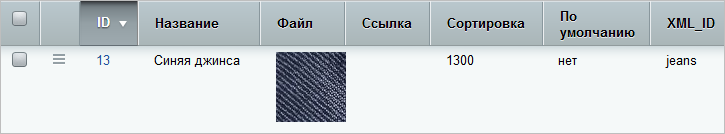

# Как подготовить XML-файл

**Навигация**
- [← Оглавление курса](index.md)
- [← Предыдущий: 9065 — Экспорт Highload-блока за 3 шага](lesson_9065.md)
- [Следующий: 9139 — Как добавить данные в Highload-блок →](lesson_9139.md)

Официальная страница урока: https://dev.1c-bitrix.ru/learning/course/index.php?COURSE_ID=48&LESSON_ID=9085

Согласитесь, что XML-файл с данными легче подготовить, если под рукой есть некий образец. Используйте

			инструмент экспорта

                    

[Подробнее...](lesson_9065.md)

		: выгрузите любой Highload-блок и используйте полученный XML-файл как основу для своего нового файла.


### Файл для добавления данных в существующий Highload-блок


- Сделайте
  			экспорт
                      
  [Подробнее...](lesson_9065.md)
  		 данного Highload-блока без выгрузки структуры (не отмечайте опцию **Экспортировать структуру**).
- Скачайте XML-файл.
- Заполните новые значения в тегах `<item>...</item>`. Например, в файле описание записи выглядит так:
  ```
  		<item>
  			<uf_name>Синяя джинса</uf_name>
  			<uf_file>blue_jeans.jpg</uf_file>
  			<uf_link />
  			<uf_sort>1300</uf_sort>
  			<uf_def>0</uf_def>
  			<uf_xml_id>jeans</uf_xml_id>
  		</item>
  ```
  Тогда в Highload-блоке запись имеет вид:
  
- Сохраните файл и используйте его для процедуры импорта.


### Файл для добавления нового Highload-блока


- Сделайте
  			экспорт
                      
  [Подробнее...](lesson_9065.md)
  		 любого Highload-блока обязательно вместе со структурой.
- Скачайте XML-файл и откройте его на редактирование:
- Задайте названия для сущности и для ее таблицы в базе данных:
  ```
  	<hiblock>
  		<name>Myhighloadblock</name>
  		<table_name>b_my_highload_block</table_name>
  	</hiblock>
  ```
- Укажите языкозависимые названия:
  ```
  	<langs>
  		<lang>
  			<lid>ru</lid>
  			<name>Мой highload-блок</name>
  		</lang>
  	</langs>
  ```
- Следующая часть файла - это блок с описанием полей Highload-блока, заключенный в теги `<fields>...</fields>`. Опишите каждое поле в `<field>...</field>`:
  ```
          <field>
              <field_name>UF_NAME</field_name>
              <user_type_id>string</user_type_id>
              <sort>100</sort>
              <multiple>N</multiple>
              <mandatory>N</mandatory>
              <show_filter>Y</show_filter>
              <show_in_list>Y</show_in_list>
              <edit_in_list>Y</edit_in_list>
              <is_searchable>Y</is_searchable>
              <settings>
                  <size>20</size>
                  <rows>1</rows>
                  <regexp />
                  <min_length>0</min_length>
                  <max_length>0</max_length>
                  <default_value />
              </settings>
              <edit_form_label>
                  <ru>Название торта</ru>
              </edit_form_label>
              <list_column_label>
                  <ru>Название торта</ru>
              </list_column_label>
              <list_filter_label>
                  <ru>Название торта</ru>
              </list_filter_label>
              <error_message>
                  <ru />
              </error_message>
              <help_message>
                  <ru />
              </help_message>
          </field>
  ```
  Параметры поля должны быть составлены так, как это требуют
  			пользовательские поля
                      
  		.
- После описания полей идет блок с записями - `<items>...</items>`. Опишите каждую запись в `<item>...</item>`. Используйте только те поля, которые вы перечислили в предыдущем блоке `<fields>...</fields>`. Например:
  ```
  		<item>
              <uf_name>Наполеон</uf_name>
          </item>
  ```
- Сохраните файл и используйте его для процедуры импорта.


**Важно!**  XML-файл должен быть подготовлен в кодировке сайта.
