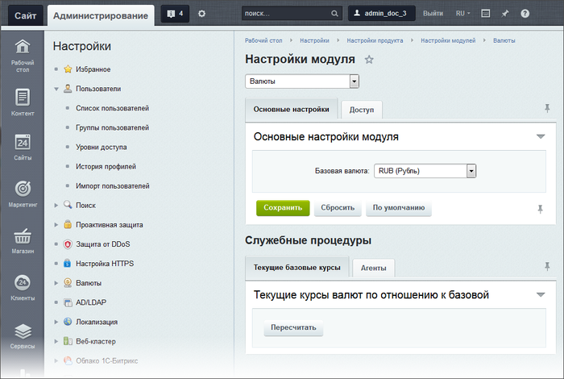

# Настройки модуля Валюты

**Навигация**
- [← Оглавление курса](index.md)
- [← Предыдущий: 2808 — Настройка модуля DAV](lesson_2808.md)
- [Следующий: 6398 — Валюты: создание и управление →](lesson_6398.md)

Официальная страница урока: https://dev.1c-bitrix.ru/learning/course/index.php?COURSE_ID=48&LESSON_ID=9095

### Что может модуль Валюты

Вся работа по управлению валютами ведется в модуле**Валюты**. Этот модуль необходим для работы

			модулей

                    Настроить работу модуля **Валюты** необходимо до того, как вы займетесь собственно созданием каталога и интернет-магазина.

		 **Торговый каталог**, **Интернет-магазин**, используется для отчетов в CRM, необходим при работе с финансовыми параметрами в рекламных кампаниях и событиях в **Веб-аналитике**. Он позволяет:

- управлять списком валют;
- задавать формат
  			представления цен в той или иной валюте
                      Обычно в торговых каталогах присутствуют товары зарубежного производства. Как правило, цена на такие товары рассчитывается, исходя из закупочной цены, зачастую устанавливаемой в иностранной валюте. Однако по российскому законодательству расчеты по торговым операциям должны осуществляться только во внутренней валюте государства (рублях). Для удобства обращения с такими товарами и ценами на них и предусмотрен модуль **Валюты**.
  Цены на товар могут быть представлены в любой из доступных в системе валют (например, в долларах, евро, рублях). При составлении платежных документов с помощью механизмов модуля Валюты все цены будут конвертированы в базовую валюту (например, в рубли) по установленному курсу.
  		;
- устанавливать курсы валют (с возможностью загрузки курса с сайта Центрального Банка РФ).

### Настройка модуля

Настройка модуля **Валюты** производится на странице Настройки &gt; Настройки продукта &gt; Настройки модулей &gt; Валюты. Форма позволяет установить базовую валюту и уровень доступа к модулю. Настройка доступа проводится типовым для *Bitrix Framework*

			способом

                    Настройка прав доступа к модулям задаёт действия, которые может позволить себе пользователь определённой группы.

[Подробнее ...](lesson_2016.md)

		.

**Примечание:** права доступа желательно ограничить и не давать большому числу пользователей. Лучше вообще оставить за одним администратором, так как обращение к модулю не требуется постоянно, а случайно изменить что-то можно. Так как изменения скажутся на работе каталога и интернет-магазина, то последствия могут быть серьезными.

Кроме того, на странице настроек модуля выполняются служебные процедуры по пересчету текущих курсов валют по отношению к базовой.

### Документация по теме

- [Настройки модуля](https://dev.1c-bitrix.ru/user_help/settings/currency/settings.php)
