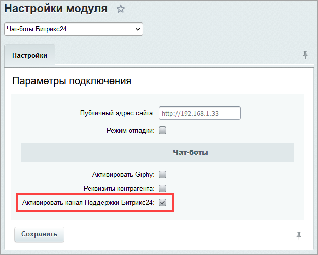
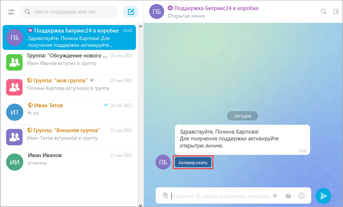
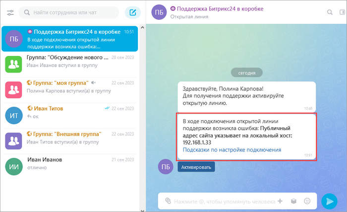
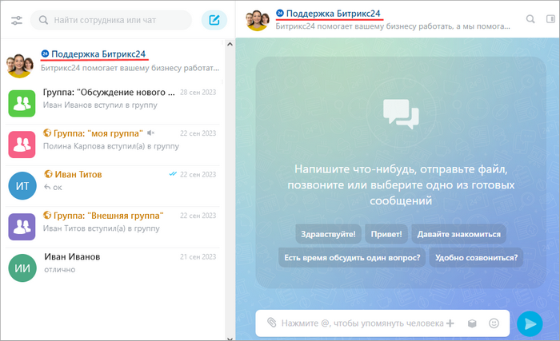

# Поддержка Битрикс24 в коробке

**Навигация**
- [← Оглавление курса](index.md)
- [← Предыдущий: 9685 — Переход на PHP 8.х](lesson_9685.md)
- [Следующий: 9225 — Исходящая почта через Яндекс →](lesson_9225.md)

Официальная страница урока: https://dev.1c-bitrix.ru/learning/course/index.php?COURSE_ID=48&LESSON_ID=9117

Администраторы *«Битрикс24»* в коробке с активной лицензией могут направить вопрос специалистам технической поддержки и получить квалифицированную консультацию прямо со своего портала. Общение c **Поддержкой Битрикс24** производится в мессенджере в специальном чате.

### Активация канала Поддержки Битрикс24

- В административном разделе откройте страницу с настройками модуля **Чат-боты Битрикс24** (Настройки &gt; Настройки продукта &gt; Настройки модулей &gt; Чат-боты Битрикс24).
- Включите опцию **Активировать канал Поддержки Битрикс24** и сохраните настройки:
  
  Первоначально чат-бот может не иметь связи с серверами *«Битрикс24»*, поэтому устанавливается как обычный бот.
- Активируйте чат-бот **Поддержка Битрикс24 в коробке** в чате:
  
  При активации чат-бота выполняется проверка доступности серверов с двух сторон – как из сети клиента, так с сервера *«Битрикс24»*, а также проверяется актуальность лицензии и запрашиваются настройки открытой линии. Если будут какие-либо ошибки, то они будут
  			выведены в чат
                      
  		 подключения.
  После успешного подключения общение с Поддержкой осуществляется в привычном чате.
  **Обратите внимание**: только официальная **Поддержка Битрикс24** имеет название и иконку с надписью 24 синего цвета. Это поможет вам отличить чат с официальной поддержкой *«Битрикс24»* от других, поскольку по поиску могут находиться разные пользователи и линии с похожим названием. Будьте внимательны!
  

### Ошибки, возникающие при подключении и обращении в чат Поддержки

**Примечание.** Ошибки чаще всего связаны либо с неправильным адресом в настройках модуля **Чат-боты Битрикс24**, либо с конфигурацией и доступом в интернет сервера, где развернута коробка *«Битрикс24»*. Поэтому решать эти вопросы должен системный администратор вашей организации.

**Указан некорректный публичный адрес сайта** – это значит, что в поле **Публичный адрес сайта** указан адрес без протокола `https://` или вообще несуществующий адрес.

**Публичный адрес сайта указывает на локальный хост** – в поле **Публичный адрес сайта** содержится частный адрес, который недоступен из интернета. Для работы чат-бота **Поддержка Битрикс24 в коробке** портал должен быть доступен извне.

**Ошибка сетевого соединения** – очень разнообразна. Зачастую это не доступен как сервер *«Битрикс24»*, так и при обратной проверке не доступен сам проверяемый портал. Также в эту ошибку входят большие таймауты сетевого соединения, а также проблемы с SSL-сертификатом портала.

**Лицензия указанного сайта недействительна** – у вас закончился срок действия лицензии *«Битрикс24»*. Поддержка осуществляется только для порталов с активной лицензией.

**Сообщение не доставлено: пользователь принимает сообщения только от своего списка контактов** – для корректной работы чата администратор, который обратился в поддержку, должен входить в структуру компании, т.е состоять в группе пользователей **Сотрудники**.

Возможно, вам пригодятся данные статьи:

 [Коробка: настройки сервера и модуля портала](https://helpdesk.bitrix24.ru/open/8442565/)

 [Настройка firewall локальной сети](https://helpdesk.bitrix24.ru/open/6354777/)

 [Группы пользователей](lesson_2487.md)

### Вопросы, которые решаются в рамках технической поддержки

## 1. Вопросы установки и настройки

## В рамках технической поддержки:

- Оказываются консультации по установке продукта на сервере (демо-версия, коммерческая версия). Консультации оказываются в объеме руководства по установке.
- Даются рекомендации по типовым проблемам возникающим при установке.
- Оказываются общие консультации по выбору серверного ПО. Список рекомендаций также приводится в соответствующих разделах документации по продукту.
- При размещении проекта на хостинге, переносе проекта с локального сервера на удаленный оказываются общие консультации по использованию средств для подготовки резервной копии проекта и использованию стандартных (встроенных) скриптов и механизмов.

## В рамках технической поддержки НЕ решаются такие вопросы, как:

- Установка программного продукта на сервере.
- Подготовка и перенос архивных копий системы на сервер.
- Диагностика серверного ПО на компьютере или сервере клиента.
- Установка серверного ПО на сервере или компьютере клиента.

## 2. Вопросы улучшения производительности

## В рамках технической поддержки:

- Оказываются общие консультации по выбору серверного ПО для улучшения производительности проектов.
- Даются рекомендации по настроечным параметрам отдельного ПО в рамках руководства по настройке веб-проектов.
- Даются рекомендации по использованию встроенных механизмов кэширования и использованию других механизмов, позволяющих снизить нагрузку на сайт.

## В рамках технической поддержки НЕ решаются такие вопросы, как:

- Непосредственная настройка ПО на компьютерах и серверах пользователей.
- Диагностика и нагрузочное тестирование проектов на серверах клиента.
- Оптимизация программного кода программных компонентов или модулей.

## 3. Вопросы обновления программного продукта

## В рамках технической поддержки:

- Выявляются и решаются проблемы с лицензионным ключом при обновлении продукта.
- Оказывается помощь в поиске и устранении проблем в случае некорректного установления обновления.

## В рамках технической поддержки НЕ решаются такие вопросы, как:

- Проблемы соединения с сервером, проблемы настройки соединения через прокси.
- Настройка сервера и серверного ПО для работы системы обновлений.

## 4. Ошибки программного продукта

## В рамках технической поддержки:

- Решаются ошибки, возникающие в процессе эксплуатации, сбоя в работе и восстановление работы проекта. Оказывается консультативная помощь в поиске и устранении причин вызвавших сбой в работе.
- Решаются ошибки программного продукта. Производится диагностика с целью установления факта ошибки в работе программного продукта. Выявленная ошибка, в зависимости от сложности, устраняется в процессе диагностики или в последующих обновлениях.

## В рамках технической поддержки НЕ решаются такие вопросы, как:

- Ошибки установки продукта. Выдаются только общие рекомендации в соответствии с руководством по установке и документацией по продукту. Предлагаются уже известные методы решения аналогичных проблем.
- Ошибки базы данных. Выдаются общие рекомендации и известные методы устранения проблем.
- Проблемы серверной настройки, которые препятствуют корректной установке обновлений. Выдаются общие рекомендации и известные методы устранения проблем. Не производится непосредственная установка обновлений.
- Поиск и устранение ошибок в работе серверного ПО.

## 5. Вопросы разработки

## В рамках технической поддержки:

- Разъясняются общие вопросы интеграции программного продукта с дизайном сайта с использованием руководства по интеграции и документации продукта.
- Оказываются консультации по вопросам использования API модулей программного продукта.
- Принимаются пожелания по разработке соответствующих скриптов принимаются отделом технической поддержки с возможным последующим включением в стандартную поставку программного продукта. Срок выполнения не определен.

## В рамках технической поддержки НЕ решаются такие вопросы, как:

- Пояснение общих вопросов программирования.
- Решение конкретных задач с заданной логикой.
- Диагностика программных решений и созданных программных компонентов.
- Разработка компонентов по заказу.
- Разработка модулей продукта по заказу.
- Кастомизация публичных скриптов и программных компонентов.
- Изменение конкретного программного кода модулей или компонентов для решения отдельных бизнес-задач. (Кроме случаев исправления ошибок в работе продукта).
- Разработка скриптов интеграции с платежными системами.

## 6. Теоретические вопросы работы с системой

## В рамках технической поддержки:

- Производится пояснение функционала модулей продукта, если соответствующее описание отсутствует в документации.
- Разъясняются вопросы лицензирования программного продукта.
- Разъясняются вопросы настройки многосайтовости в случае возникновения затруднений при работе с соответствующей документацией и руководствами.
- Разъясняются вопросы настройки безопасности при использовании продукта.
- Принимаются пожелания и запросы по совершенствованию функционала продукта.
- Возможна работа с документацией, пополнение документации.

**Внимание!** Есть несколько важных моментов:

- Общаться в чате с **Поддержкой Битрикс24** может только администратор портала.
- Для чата с **Поддержкой Битрикс24** необходим доступ в интернет с этого портала.
- Адрес, указанный в поле **Публичный адрес сайта**, должен быть доступен из интернета.
- Если доступ к порталу закрыт из интернета, то необходимо сделать предварительные [настройки сервера и модулей](lesson_8405.md).
- SSL-сертификат должен быть валидным, самоподписанный использовать нельзя.
- Перед обращением в Поддержку должны быть установлены все стабильные обновления *«Битрикс24»*.
- Коммерческая лицензия (не демо!) на коробочную версию *«Битрикс24»* должна быть активна.
- Поддержка работает с 10:00 до 19:00 по московскому времени с понедельника по пятницу, кроме выходных и праздничных дней Российской Федерации.
- Если специалист Поддержки не видит ваши скриншоты в чате поддержки и выдается ошибка *К сожалению, время действия ссылки закончилось. Чтобы продолжить работу, перейдите по ссылке в письме снова*, то, скорей всего, у вас запрещен доступ на чтение к директории `/pub/` для неавторизованных пользователей. Проверьте в административном интерфейсе в разделе Управление структурой &gt; Файлы и папки, чтобы был доступ на чтение для директории `/pub/` и всем вложенным файлам для группы **Все пользователи (в том числе неавторизованные)**. Если права менялись на уровне сервера, то необходимо также их изменить администратору сервера.
