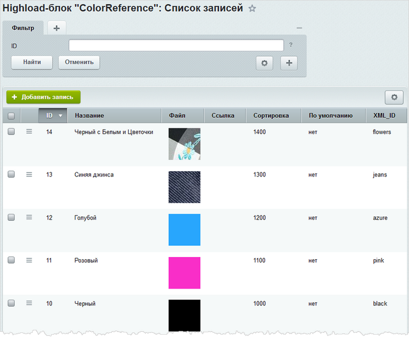
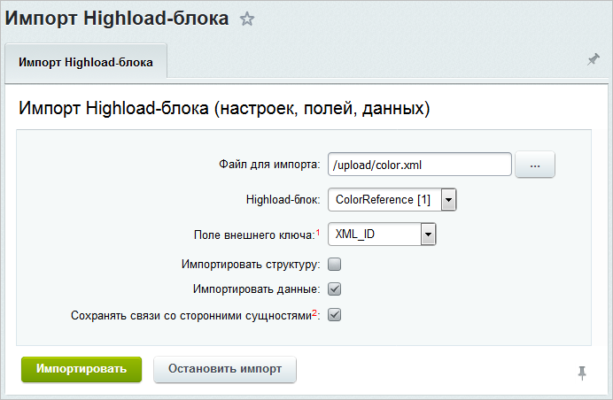
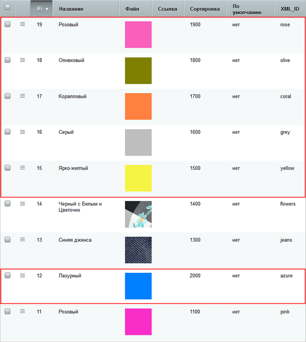

# Как добавить данные в Highload-блок

**Навигация**
- [← Оглавление курса](index.md)
- [← Предыдущий: 9085 — Как подготовить XML-файл](lesson_9085.md)
- [Следующий: 9071 — Как загрузить целый Highload-блок →](lesson_9071.md)

Официальная страница урока: https://dev.1c-bitrix.ru/learning/course/index.php?COURSE_ID=48&LESSON_ID=9139

Инструмент импорта экономит ваше время, когда вы пополняете или обновляете Highload-блок новыми записями. Подготовьте всего лишь

			XML-файл с данными

                    Как подготовить XML-файл см. в предыдущем [уроке](lesson_9085.md)

		. Инструмент быстро загрузит большие объемы информации в Highload-блок.


### Видеоурок


<!-- &lt;iframe title="Добавление новых элементов в Highload-блок через инструменты экспорта/импорта" src="//www.youtube.com/embed/_ZB7hGlwovo?feature=oembed&rel=0" allowfullscreen="" width="853" height="480" frameborder="0"&gt;
	<br>
	&lt;/iframe&gt; -->


### Как добавить данные в Highload-блок


Рассмотрим на примере. Представьте, что у вас есть Highload-блок **ColorReference**. Он представляет собой справочник цветов и содержит уже некоторое количество записей:





Добавим в него несколько новых записей, а одну запись обновим. Структуру самого Highload-блока изменять не будем.


- **Шаг 1.** Подготовьте изображения и файл **color.xml** с данными:
  ```
  <?xml version="1.0" encoding="UTF-8"?>
  <hiblock>
  	<items>
  		<item>
  			<uf_name>Ярко-желтый</uf_name>
  			<uf_file>yellow.png</uf_file>
  			<uf_sort>1500</uf_sort>
  			<uf_xml_id>yellow</uf_xml_id>
  		</item>
  		<item>
  			<uf_name>Серый</uf_name>
  			<uf_file>grey.png</uf_file>
  			<uf_sort>1600</uf_sort>
  			<uf_xml_id>grey</uf_xml_id>
  		</item>
  		<item>
  			<uf_name>Коралловый</uf_name>
  			<uf_file>coral.png</uf_file>
  			<uf_sort>1700</uf_sort>
  			<uf_xml_id>coral</uf_xml_id>
  		</item>
  		<item>
  			<uf_name>Оливковый</uf_name>
  			<uf_file>olive.png</uf_file>
  			<uf_sort>1800</uf_sort>
  			<uf_xml_id>olive</uf_xml_id>
  		</item>
  		<item>
  			<uf_name>Розовый</uf_name>
  			<uf_file>rose.png</uf_file>
  			<uf_sort>1900</uf_sort>
  			<uf_xml_id>rose</uf_xml_id>
  		</item>
  		<item>
  			<uf_name>Лазурный</uf_name>
  			<uf_file>azure.png</uf_file>
  			<uf_sort>2000</uf_sort>
  			<uf_xml_id>azure</uf_xml_id>
  		</item>
  	</items>
  </hiblock>
  ```
- **Шаг 2.** Загрузите на сайт файл **color.xml**, скажем, в папку **upload**. Изображения загрузите в каталог `/upload/color_files/`.
  **Примечание:** изображения (любые другие файлы) обязательно должны располагаться в папке с названием ***&lt;имя_файла_экспорта&gt;*_files**. Она размещается внутри той же папки, где и файл экспорта.
- **Шаг 3.** Откройте страницу импорта данных в  Highload-блок (Контент &gt; Highload-блоки &gt; Экспорт/импорт &gt; Импорт):
  
- **Шаг 4.** Укажите параметры импорта:

  - В поле **Файл для импорта** укажите наш файл **color.xml**.
    
  - В поле **Highload-блок** выберите **ColorReference**.
  - В нашем примере записи Highload-блока считаются уникальными по внешнему коду. Следовательно, в параметре **Поле внешнего ключа** выберите значение **XML_ID**.
    Если внешний код из файла совпадет с кодом для существующей записи Highload-блока, то параметры записи будут обновлены в соответствии со значениями в файле.
  - Флаг с опции **Импортировать структуру** обязательно должен быть снят. Отмечена должна быть только опция **Импортировать данные**.
  - Опцию **Сохранять связи со сторонними сущностями** рекомендуется также отметить. Тогда при импорте Highload-блока будут сохранены связи со сторонними сущностями – например, с элементами инфоблока, к которым эти цвета уже привязаны. В противном случае связи будут сброшены.
- **Шаг 5.** Запустите процесс импорта. По окончании вы увидите
  			специальное сообщение
                      
  		.
- **Шаг 6.** Оцените результат импорта. Откройте страницу с записями Highload-блока **ColorReference**.
  
  Новые записи добавились. При этом обратите внимание, что у нас теперь 2 розовых цвета. Старый розовой цвет не обновился, потому что у него отличается внешний код от кода нового розового цвета. А вот голубой цвет изменил название на лазурный, поскольку у него такой же внешний код, как и у лазурного цвета - **azure**.


Как видите, дополнить и обновить Highload-блок новыми записями легко и просто с инструментом импорта.
